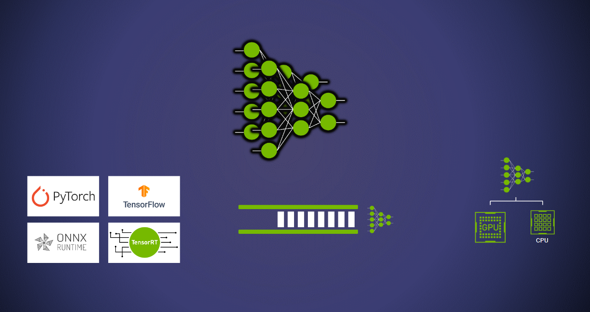

# 使用Triton部署模型

| 导航到 | [第 2 部分：提高资源利用率](../Part_2-improving_resource_utilization/) | [文档：模型存储库](https://github.com/triton-inference-server/server/blob/main/docs/user_guide/model_repository.md) | [文档：模型配置](https://github.com/triton-inference-server/server/blob/main/docs/user_guide/model_configuration.md) |
| ------------ | --------------- | --------------- | --------------- |

任何深度学习推理服务解决方案都需要解决两个基本挑战：

* 管理多个模型。
* 版本控制、加载和卸载模型。

## 开始之前

该概念指南旨在向开发人员介绍在构建用于部署深度学习流水线的推理基础设施时所面临的挑战。 本指南`第一部分 - 第五部分`旨在解决一个简单的问题：部署高性能且可扩展的流水线，用于从图像中转录文本。此管道包括 5 个步骤：

1. 预处理原始图像
1. 检测图像的哪些部分包含文本（文本检测模型）
1. 将图像裁剪为带有文本的区域
1. 查找文本概率（文本识别模型）
1. 将概率转换为实际文本

在`第一部分`中，我们首先在Triton上部署两个模型，并在客户端上完成预/后处理步骤。

## 部署多个模型

管理多个模型的主要挑战是构建能够满足不同模型不同需求的基础架构。例如，用户可能需要在同一台服务器上部署 PyTorch 模型和 TensorFlow 模型，并且这两个模型的负载不同，需要在不同的硬件设备上运行它们，并且需要独立管理服务配置（模型队列、版本、缓存、加速等）。Triton 推理服务器可以满足上述所有需求以及更多需求。



使用 Triton 推理服务器部署模型的第一步是构建一个存储库，其中包含将要提供服务的模型和配置架构。在本演示中，我们将使用 [EAST](https://arxiv.org/pdf/1704.03155v2.pdf) 模型来检测文本和文本识别模型。此工作流程在很大程度上是对[OpenCV 的文本检测](https://docs.opencv.org/4.x/db/da4/samples_2dnn_2text_detection_8cpp-example.html)示例的改编。

首先，让我们克隆存储库并导航到此文件夹。

```bash
cd Conceptual_Guide/Part_1-model_deployment
```

接下来，我们将下载必要的模型，并确保它们采用triton可以部署的格式。

### 模型 1：文本检测

下载并解压缩 OpenCV 的 EAST 模型。

```bash
wget https://www.dropbox.com/s/r2ingd0l3zt8hxs/frozen_east_text_detection.tar.gz
tar -xvf frozen_east_text_detection.tar.gz
```

导出到 ONNX。
>注意：以下步骤要求您安装 TensorFlow 库。我们建议在 NGC TensorFlow 容器环境中执行以下步骤，您可以使用该指令启动该环境`docker run -it --gpus all -v ${PWD}:/workspace nvcr.io/nvidia/tensorflow:<yy.mm>-tf2-py3`

```bash
pip install -U tf2onnx
python -m tf2onnx.convert --input frozen_east_text_detection.pb --inputs "input_images:0" --outputs "feature_fusion/Conv_7/Sigmoid:0","feature_fusion/concat_3:0" --output detection.onnx
```

### 模型 2：文本识别

下载文本识别模型权重。

```bash
wget https://www.dropbox.com/sh/j3xmli4di1zuv3s/AABzCC1KGbIRe2wRwa3diWKwa/None-ResNet-None-CTC.pth
```

使用`utils`文件夹中模型定义文件中的文件将模型导出为`.onnx`。该文件改编自[Baek et. al. 2019](https://github.com/clovaai/deep-text-recognition-benchmark)。

>注意：以下 python 脚本要求您安装 PyTorch 库。我们建议在 NGC PyTorch 容器环境中执行以下步骤，您可以使用该指令启动该环境`docker run -it --gpus all -v ${PWD}:/workspace nvcr.io/nvidia/pytorch:<yy.mm>-py3`

```python
import torch
from utils.model import STRModel

# Create PyTorch Model Object
model = STRModel(input_channels=1, output_channels=512, num_classes=37)

# Load model weights from external file
state = torch.load("None-ResNet-None-CTC.pth")
state = {key.replace("module.", ""): value for key, value in state.items()}
model.load_state_dict(state)

# Create ONNX file by tracing model
trace_input = torch.randn(1, 1, 32, 100)
torch.onnx.export(model, trace_input, "str.onnx", verbose=True)
```

### 设置模型存储库

[模型存储库](https://docs.nvidia.com/deeplearning/triton-inference-server/user-guide/docs/user_guide/model_repository.html)是 Triton 读取模型以及与每个模型（配置、版本文件等）相关的任何元数据的方式。这些模型存储库可以位于本地或网络连接的文件系统中，也可以位于 AWS S3、Azure Blob Storage 或 Google Cloud Storage 等云对象存储中。有关模型存储库位置的更多详细信息，请参阅[文档](https://docs.nvidia.com/deeplearning/triton-inference-server/user-guide/docs/user_guide/model_repository.html#model-repository-locations)。服务器还可以使用多个不同的模型存储库。为简单起见，此说明仅使用存储在[本地文件系统](https://docs.nvidia.com/deeplearning/triton-inference-server/user-guide/docs/user_guide/model_repository.html#local-file-system)中的单个存储库，格式如下：

```bash
# Example repository structure
<model-repository>/
  <model-name>/
    [config.pbtxt]
    [<output-labels-file> ...]
    <version>/
      <model-definition-file>
    <version>/
      <model-definition-file>
    ...
  <model-name>/
    [config.pbtxt]
    [<output-labels-file> ...]
    <version>/
      <model-definition-file>
    <version>/
      <model-definition-file>
    ...
  ...
```

从上述结构中可以讨论三个重要组成部分：

* `model-name`: 模型的标识名称。
* `config.pbtxt`: 对于每个模型，用户可以定义模型配置。此配置至少需要定义：后端、名称、形状和模型输入和输出的数据类型。对于大多数流行的后端，此配置文件是自动生成的，具有默认值。配置文件的完整规范可以在 [`model_config` protobuf 定义](https://github.com/triton-inference-server/common/blob/main/protobuf/model_config.proto)中找到。
* `version`: 版本控制使同一模型的多个版本可供使用，具体取决于所选的策略。[有关版本控制的更多信息.](https://docs.nvidia.com/deeplearning/triton-inference-server/user-guide/docs/user_guide/model_repository.html#model-versions)

对于此示例，您可以按以下方式设置模型存储库结构：

```bash
mkdir -p model_repository/text_detection/1
mv detection.onnx model_repository/text_detection/1/model.onnx

mkdir -p model_repository/text_recognition/1
mv str.onnx model_repository/text_recognition/1/model.onnx
```

这些命令应为您提供一个如下所示的存储库：

```bash
# Expected folder layout
model_repository/
├── text_detection
│   ├── 1
│   │   └── model.onnx
│   └── config.pbtxt
└── text_recognition
    ├── 1
    │   └── model.onnx
    └── config.pbtxt
```

请注意，在此示例中，我们已经创建了`config.pbtxt`文件并将它们放置在必要的位置。在下一节中，我们将讨论这些文件的内容。

### 模型配置

模型和文件结构准备好后，我们需要查看的下一个内容是 `config.pbtxt` 模型配置文件。我们先来看一下在 `/model_repository/text_detection/config.pbtxt` 中为你提供的 `EAST text detection` 模型的模型配置。这表明 `text_detection` 是一个 ONNX 模型，它有一个 `input` 和两个 `output` 张量。

``` text proto
name: "text_detection"
backend: "onnxruntime"
max_batch_size : 256
input [
  {
    name: "input_images:0"
    data_type: TYPE_FP32
    dims: [ -1, -1, -1, 3 ]
  }
]
output [
  {
    name: "feature_fusion/Conv_7/Sigmoid:0"
    data_type: TYPE_FP32
    dims: [ -1, -1, -1, 1 ]
  }
]
output [
  {
    name: "feature_fusion/concat_3:0"
    data_type: TYPE_FP32
    dims: [ -1, -1, -1, 5 ]
  }
]
```

* `name`:  “name” 是一个可选字段，其值应与模型目录的名称匹配。
* `backend`: 此字段指示用于运行模型的后端。Triton 支持多种后端，如 TensorFlow、PyTorch、Python、ONNX 等。有关字段选择的完整列表，请参阅[这些注释](https://github.com/triton-inference-server/backend#backends)。
* `max_batch_size`: 顾名思义，此字段定义了模型可以支持的最大批量大小。
* `input` 和 `output`: 输入和输出部分指定名称、形状、数据类型等，同时提供[reshaping](https://github.com/triton-inference-server/server/blob/main/docs/user_guide/model_configuration.md#reshape)和支持[不规则批处理](https://github.com/triton-inference-server/server/blob/main/docs/user_guide/ragged_batching.md#ragged-batching)等操作。

在[大多数情况](https://docs.nvidia.com/deeplearning/triton-inference-server/user-guide/docs/user_guide/model_configuration.html#auto-generated-model-configuration)下，可以省略 `input` 和 `output` 部分，让 Triton 直接从模型文件中提取该信息。在这里，为了清楚起见，我们将它们包括在内，因为稍后我们需要知道客户端应用程序中输出张量的名称。

有关所有支持的字段及其值的详细信息，请参阅[模型配置protobuf定义文件](https://github.com/triton-inference-server/common/blob/main/protobuf/model_config.proto)。

### 启动服务器

创建存储库并配置模型后，我们已准备好启动服务器。虽然 Triton 推理服务器可以[从源代码构建](https://github.com/triton-inference-server/server/blob/main/docs/customization_guide/build.md#building-triton)，但对于此示例，强烈建议使用从 NGC 免费提供的[预构建 Docker 容器](https://catalog.ngc.nvidia.com/orgs/nvidia/containers/tritonserver)。

```bash
# Replace the yy.mm in the image name with the release year and month
# of the Triton version needed, eg. 22.08

docker run --gpus=all -it --shm-size=256m --rm -p8000:8000 -p8001:8001 -p8002:8002 -v $(pwd)/model_repository:/models nvcr.io/nvidia/tritonserver:<yy.mm>-py3
```

一旦Triton Inference Server被构建或进入容器，就可以使用以下命令启动它：

```bash
tritonserver --model-repository=/models
```

这将启动服务器，模型实例将准备好进行推理。

```text
I0712 16:37:18.246487 128 server.cc:626]
+------------------+---------+--------+
| Model            | Version | Status |
+------------------+---------+--------+
| text_detection   | 1       | READY  |
| text_recognition | 1       | READY  |
+------------------+---------+--------+

I0712 16:37:18.267625 128 metrics.cc:650] Collecting metrics for GPU 0: NVIDIA GeForce RTX 3090
I0712 16:37:18.268041 128 tritonserver.cc:2159]
+----------------------------------+----------------------------------------------------------------------------------------------------------------------------------------------------------------------------------------------+
| Option                           | Value                                                                                                                                                                                        |
+----------------------------------+----------------------------------------------------------------------------------------------------------------------------------------------------------------------------------------------+
| server_id                        | triton                                                                                                                                                                                       |
| server_version                   | 2.23.0                                                                                                                                                                                       |
| server_extensions                | classification sequence model_repository model_repository(unload_dependents) schedule_policy model_configuration system_shared_memory cuda_shared_memory binary_tensor_data statistics trace |
| model_repository_path[0]         | /models                                                                                                                                                                                      |
| model_control_mode               | MODE_NONE                                                                                                                                                                                    |
| strict_model_config              | 1                                                                                                                                                                                            |
| rate_limit                       | OFF                                                                                                                                                                                          |
| pinned_memory_pool_byte_size     | 268435456                                                                                                                                                                                    |
| cuda_memory_pool_byte_size{0}    | 67108864                                                                                                                                                                                     |
| response_cache_byte_size         | 0                                                                                                                                                                                            |
| min_supported_compute_capability | 6.0                                                                                                                                                                                          |
| strict_readiness                 | 1                                                                                                                                                                                            |
| exit_timeout                     | 30                                                                                                                                                                                           |
+----------------------------------+----------------------------------------------------------------------------------------------------------------------------------------------------------------------------------------------+

I0712 16:37:18.269464 128 grpc_server.cc:4587] Started GRPCInferenceService at 0.0.0.0:8001
I0712 16:37:18.269956 128 http_server.cc:3303] Started HTTPService at 0.0.0.0:8000
I0712 16:37:18.311686 128 http_server.cc:178] Started Metrics Service at 0.0.0.0:8002
```

## 构建客户端应用程序

现在我们的 Triton 服务器已经启动，我们可以开始向它发送消息了。有三种方法可以与 Triton 推理服务器进行交互：

* HTTP(S) API
* gRPC API
* Native C API

[C++](https://github.com/triton-inference-server/client/tree/main/src/c%2B%2B)、[Python](https://github.com/triton-inference-server/client/tree/main/src/python) 和 [Java](https://github.com/triton-inference-server/client/tree/main/src/java) 中也有预构建的[客户端库](https://github.com/triton-inference-server/client#client-library-apis)，它们覆盖了 HTTP 和 gRPC API。此示例在`client.py`中包含一个 Python 客户端脚本，该脚本使用 `tritonclient` 的python 库通过 HTTP API 与 Triton 通信。

让我们检查一下这个文件的内容：

* 首先，我们从`tritonclient`库中导入 HTTP 客户端，以及用于处理图像的其他一些库：

  ```python
  import math
  import numpy as np
  import cv2
  import tritonclient.http as httpclient
  ```

* 接下来，我们将定义一些辅助函数，用于处理流水线中的预处理和后处理步骤。为简洁起见，此处省略了详细信息，但您可以查看`client.py`文件以获取更多详细信息

  ```python
  def detection_preprocessing(image: cv2.Mat) -> np.ndarray:
    ...

  def detection_postprocessing(scores: np.ndarray, geometry: np.ndarray, preprocessed_image: np.ndarray) -> np.ndarray:
    ...

  def recognition_postprocessing(scores: np.ndarray) -> str:
    ...
  ```

* 然后，我们创建一个客户端对象，并初始化与 Triton 推理服务器的连接。

  ```python
  client = httpclient.InferenceServerClient(url="localhost:8000")
  ```

* 现在，我们将创建从我们的数据发送到Triton的`InferInput`内容。

  ```python
  raw_image = cv2.imread("./img2.jpg")
  preprocessed_image = detection_preprocessing(raw_image)

  detection_input = httpclient.InferInput("input_images:0", preprocessed_image.shape, datatype="FP32")
  detection_input.set_data_from_numpy(preprocessed_image, binary_data=True)
  ```

* 最后，我们准备向 Triton 推理服务器发送推理请求并获取响应

  ```python
  detection_response = client.infer(model_name="text_detection", inputs=[detection_input])
  ```

* 之后，我们将使用文本识别模型重复该过程，执行下一个处理步骤，创建输入对象，查询服务器，最后执行后处理并打印结果。

  ```python
  # Process responses from detection model
  scores = detection_response.as_numpy('feature_fusion/Conv_7/Sigmoid:0')
  geometry = detection_response.as_numpy('feature_fusion/concat_3:0')
  cropped_images = detection_postprocessing(scores, geometry, preprocessed_image)

  # Create input object for recognition model
  recognition_input = httpclient.InferInput("input.1", cropped_images.shape, datatype="FP32")
  recognition_input.set_data_from_numpy(cropped_images, binary_data=True)

  # Query the server
  recognition_response = client.infer(model_name="text_recognition", inputs=[recognition_input])

  # Process response from recognition model
  text = recognition_postprocessing(recognition_response.as_numpy('308'))

  print(text)
  ```

让我们试试吧！

```bash
pip install tritonclient[http] opencv-python-headless
python client.py
```

您可能已经注意到，检索第一个模型的结果只是为了进行一些处理并将它们直接发送回 Triton 有点多余。在本教程的[第 5 部分](../Part_5-Model_Ensembles/)中，我们将探讨如何将更多处理步骤移动到服务器，并在单个网络调用中执行多个模型。

## 模型版本控制

部署不同版本的模型的能力对于构建 MLOps 流水线至关重要。这种需求来自进行 A/B 测试、简单的模型版本回滚等用例。Triton 用户可以在同一存储库中添加文件夹和新模型：

```text
model_repository/
├── text_detection
│   ├── 1
│   │   └── model.onnx
│   ├── 2
│   │   └── model.onnx
│   └── config.pbtxt
└── text_recognition
    ├── 1
    │   └── model.onnx
    └── config.pbtxt
```

默认情况下，Triton 提供 "latest" 模型，但服务于模型的不同版本的策略是可自定义的。有关详细信息，[请参阅本指南](https://github.com/triton-inference-server/server/blob/main/docs/user_guide/model_configuration.md#version-policy)。

## 装载和卸载模型

Triton 具有模型管理 API，可用于控制模型加载卸载策略。在需要加载或卸载一个或多个模型的情况下，此 API 非常有用，而不会中断对同一服务器上提供的其他模型的推理。用户可以从以下三种控制模式中选择一种：

* NONE
* EXPLICIT
* POLL

```bash
tritonserver --model-repository=/models --model-control-mode=poll
```

在启动服务器时，还可以通过命令行参数设置策略。有关详细信息，请参阅文档的[此部分](https://github.com/triton-inference-server/server/blob/main/docs/user_guide/model_management.md#model-management)。

# 下一步是什么？

在本教程中，我们介绍了设置和查询 Triton 推理服务器的基础知识。这是由 6 部分组成的教程系列的第 1 部分，该系列介绍了将深度学习模型部署到生产环境时面临的挑战。[第 2 部分](../Part_2-improving_resource_utilization/) 涵盖了 `并发模型执行和动态批处理`. 根据您的工作量和经验，您可能需要跳转到 [第 5 部分](../Part_5-Model_Ensembles/)，该部分涵盖了`构建具有多个模型、预处理和后处理步骤并添加业务逻辑的集成流水线`。
