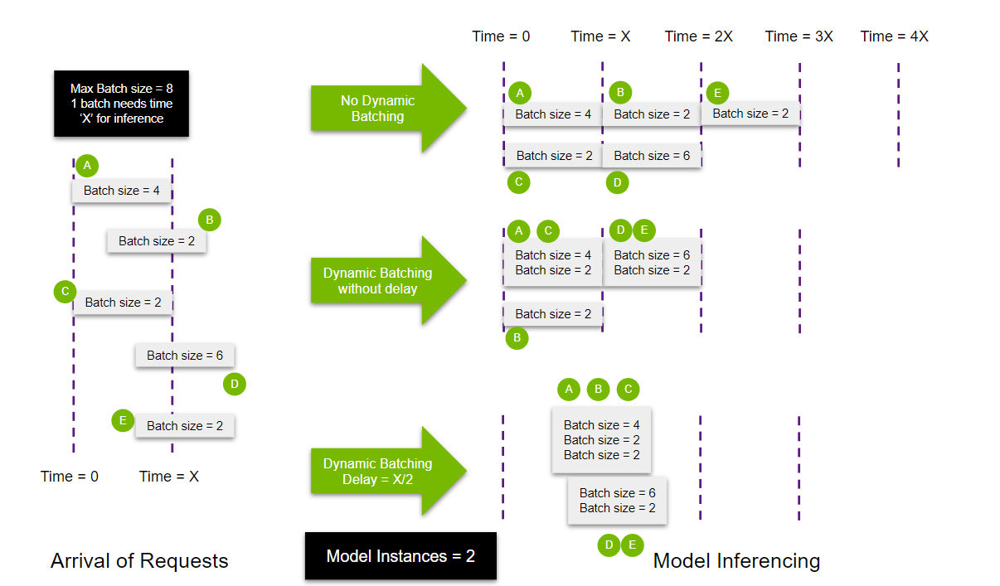

# 动态批处理和并发模型执行

| 导航到 | [第 1 部分：模型部署](../Part_1-model_deployment/) | [第 3 部分：优化 Triton 配置](../Part_3-optimizing_triton_configuration/) |
| ------------ | --------------- | --------------- |

本系列的第 1 部分介绍了设置 Triton 推理服务器的机制。本环节讨论了动态批处理和并发模型执行的概念。这些都是重要的功能，可用于减少延迟，并通过提高资源利用率来增加吞吐量。

## 什么是动态批处理？

动态批处理，参考 Triton 推理服务器，是指允许将一个或多个推理请求组合到单个批处理（必须动态创建）以最大限度地提高吞吐量的功能。

通过在模型的`config.pbtxt`中指定选项，可以基于每个模型启用和配置动态批处理。通过将以下内容添加到`config.pbtxt`文件中，可以使用其默认设置启用动态批处理：
```
dynamic_batching { }
```
当Triton在没有任何延迟的情况下对这些传入请求进行批处理时，用户可以选择为调度器分配有限的延迟，以收集更多的推理请求供动态批处理器使用。

```
dynamic_batching {
    max_queue_delay_microseconds: 100
}
```
让我们讨论一个示例场景（请参阅下图）。假设有5个推理请求，`A`, `B`, `C`, `D`,和`E`，批大小分别为`4`, `2`, `2`, `6`和`2`。每个批次都需要模型处理`X ms`的时间。该模型支持的最大批量大小为`8`。`A`和`C`在时间`T = 0`到达，`B`在时间`T = X/3`到达，而`D` 和 `E`在时间`T = 2*X/3`到达。


在不使用动态批处理的情况下，所有请求都是按顺序处理的，这意味着处理所有请求需要`5X ms`。这个过程非常浪费，因为每个批处理可以处理的批次数比顺序执行时处理的批次数要多。

在这种情况下使用动态批处理可以将请求更有效地打包到GPU内存中，从而实现更快的`3X ms`完成。它还减少了响应的延迟，因为可以在更少的周期内处理更多的查询。如果考虑使用`delay`，可以将`A`, `B`, `C`和`D`, `E`分批在一起，以更好地利用资源。

**注意：** 上述情况是理想情况下的极端版本。在实践中，并非所有执行元素都可以完全并行，因为更大的批处理需要更长的执行时间。

从上面可以看出，在模型服务化时，使用动态批处理可以同时改善延迟和吞吐量。此批处理功能主要侧重于为无状态模型（在执行之间不维护状态的模型，如目标检测模型）提供解决方案。Triton 的[序列批处理器](https://github.com/triton-inference-server/server/blob/main/docs/model_configuration.md#sequence-batcher)可用于管理有状态模型的多个推理请求。有关动态批处理的更多信息和配置，请参阅 Triton 推理服务器[文档](https://github.com/triton-inference-server/server/blob/main/docs/model_configuration.md#scheduling-and-batching)。

## 并发模型执行

Triton 推理服务器可以启动同一模型的多个实例，这些实例可以并行处理查询。Triton 可以在同一设备（GPU）上生成实例，也可以根据用户的规格在相同节点上的不同设备上生成实例。在考虑具有不同吞吐量模型的集成时，这种可定制性特别有用。可以在单独的 GPU 上生成较重模型的多个副本，以允许更多的并行处理。这是通过在模型配置中使用 `instance groups` 选项来实现的。

```
instance_group [
  {
    count: 2
    kind: KIND_GPU
    gpus: [ 0, 1 ]
  }
]
```

我们以前面的例子为例，讨论添加多个模型进行并行执行的效果。在此示例中，不是让单个模型处理五个查询，而是生成两个模型。

对于“无动态批处理”情况，由于有多个模型要执行，因此查询将平均分布。用户还可以添加[优先级](https://github.com/triton-inference-server/server/blob/main/docs/model_configuration.md#priority)，以优先处理或降低优先处理任何特定的实例组。

在考虑启用了动态批处理的多个实例的情况时，会发生以下情况。由于有另一个实例可用，有一些延时的查询 `B` 可以使用第二个实例执行。动态批处理配置了一些延迟后，实例1在时间 `T = X/2` 时被填充并启动，并且由于查询 `D` 和 `E` 堆叠去填充到最大批处理大小，因此第二个模型可以没有延迟地开始推理。

从上述示例中得出的关键结论是，Triton 推理服务器在创建更高效的批处理相关策略方面十分灵活，从而实现了更好的资源利用率，达到了减少了延迟并提高了吞吐量的目的。

## 示范

本节使用本系列第 1 部分的示例演示动态批处理和并发模型执行的使用。

### 获取模型访问权限

让我们使用第 1 部分中使用的 `text recognition` 。我们确实需要对模型进行一些细微的更改，即使模型的第 0 个维度具有动态形状以启用批处理。步骤 1，下载文本识别模型权重。使用 NGC PyTorch 容器作为以下内容的环境。
```
docker run -it --gpus all -v ${PWD}:/scratch nvcr.io/nvidia/pytorch:<yy.mm>-py3
cd /scratch
wget https://www.dropbox.com/sh/j3xmli4di1zuv3s/AABzCC1KGbIRe2wRwa3diWKwa/None-ResNet-None-CTC.pth
```
使用`utils`文件夹中的文件将模型导出为`.onnx`。该文件改编自[Baek et. al. 2019](https://github.com/clovaai/deep-text-recognition-benchmark)。
```
import torch
from utils.model import STRModel

# Create PyTorch Model Object
model = STRModel(input_channels=1, output_channels=512, num_classes=37)

# Load model weights from external file
state = torch.load("None-ResNet-None-CTC.pth")
state = {key.replace("module.", ""): value for key, value in state.items()}
model.load_state_dict(state)

# Create ONNX file by tracing model
trace_input = torch.randn(1, 1, 32, 100)
torch.onnx.export(model, trace_input, "str.onnx", verbose=True, dynamic_axes={'input.1':[0],'308':[0]})
```

### 启动服务器

如 `Part 1` 所述，模型存储库是被Triton 推理服务器使用的基于文件系统的模型和配置模式存储库（有关模型存储库的更详细说明，请参阅 `Part 1` ）。对于此示例，需要按以下方式设置模型存储库结构：
```
model_repository
|
|-- text_recognition
    |
    |-- config.pbtxt
    |-- 1
        |
        |-- model.onnx
```
该存储库是前一示例的子集。此设置中的关键区别是在模型配置中使用了 `instance_group`(s) 和 `dynamic_batching` 。新增内容如下：

```
instance_group [
    {
      count: 2
      kind: KIND_GPU
    }
]
dynamic_batching { }
```
使用 `instance_group` ，用户主要可以调整两个方面。首先，该模型部署在每个GPU上的实例个数。上面的示例将 `每个GPU` 上的模型部署了 `2` 个实例。其次，可以用 `gpus: [ <device number>, ... <device number> ]` 指定该组的目标GPU。

添加 `dynamic_batching {}` 将允许使用动态批处理。用户还可以在动态批处理中添加 `preferred_batch_size` 和 `max_queue_delay_microseconds` 来根据其使用情况更有效地管理批处理。更多相关信息，请浏览[模型配置](https://github.com/triton-inference-server/server/blob/main/docs/model_configuration.md#model-configuration)。

设置模型存储库后，可以启动 Triton 推理服务器。
```
docker run --gpus=all -it --shm-size=256m --rm -p8000:8000 -p8001:8001 -p8002:8002 -v ${PWD}:/workspace/ -v ${PWD}/model_repository:/models nvcr.io/nvidia/tritonserver:yy.mm-py3 bash

tritonserver --model-repository=/models
```

### 衡量性能

通过启用`dynamic batching`和使用`multiple model instances`对模型服务器功能进行了一些改进，下一步是衡量这些功能地影响。为此，Triton Inference Server附带了一个[性能分析器](https://github.com/triton-inference-server/client/blob/main/src/c++/perf_analyzer/README.md)，这是一个专门测量Triton Inference Server性能的工具。为了便于使用，建议用户在本系列第一部分中运行客户端代码的容器内运行该工具。
```
docker run -it --net=host -v ${PWD}:/workspace/ nvcr.io/nvidia/tritonserver:yy.mm-py3-sdk bash
```
在第三个终端上，建议监视GPU利用率，以查看部署是否使GPU资源饱和。
```
watch -n0.1 nvidia-smi
```

为了衡量性能的提升，让我们在以下配置上运行性能分析器：

* **无动态批处理，单模型实例**：此配置将是基线测量。要在此配置中设置 Triton Server，请不要在 `config.pbtxt` 中添加 `instance_group` 或 `dynamic_batching`，并确保在`docker run` 命令中包含`--gpus=1`来设置服务器。

```
# perf_analyzer -m <model name> -b <batch size> --shape <input layer>:<input shape> --concurrency-range <lower number of request>:<higher number of request>:<step>

# Query
perf_analyzer -m text_recognition -b 2 --shape input.1:1,32,100 --concurrency-range 2:16:2 --percentile=95

# Summarized Inference Result
Inferences/Second vs. Client p95 Batch Latency
Concurrency: 2, throughput: 955.708 infer/sec, latency 4311 usec
Concurrency: 4, throughput: 977.314 infer/sec, latency 8497 usec
Concurrency: 6, throughput: 973.367 infer/sec, latency 12799 usec
Concurrency: 8, throughput: 974.623 infer/sec, latency 16977 usec
Concurrency: 10, throughput: 975.859 infer/sec, latency 21199 usec
Concurrency: 12, throughput: 976.191 infer/sec, latency 25519 usec
Concurrency: 14, throughput: 966.07 infer/sec, latency 29913 usec
Concurrency: 16, throughput: 975.048 infer/sec, latency 34035 usec

# Perf for 16 concurrent requests
Request concurrency: 16
  Client:
    Request count: 8777
    Throughput: 975.048 infer/sec
    p50 latency: 32566 usec
    p90 latency: 33897 usec
    p95 latency: 34035 usec
    p99 latency: 34241 usec
    Avg HTTP time: 32805 usec (send/recv 43 usec + response wait 32762 usec)
  Server:
    Inference count: 143606
    Execution count: 71803
    Successful request count: 71803
    Avg request latency: 17937 usec (overhead 14 usec + queue 15854 usec + compute input 20 usec + compute infer 2040 usec + compute output 7 usec)
```

* **仅动态批处理**: 要在此配置中设置 Triton Server，请在 `config.pbtxt` 中添加 `dynamic_batching`。
```
# Query
perf_analyzer -m text_recognition -b 2 --shape input.1:1,32,100 --concurrency-range 2:16:2 --percentile=95

# Inference Result
Inferences/Second vs. Client p95 Batch Latency
Concurrency: 2, throughput: 998.141 infer/sec, latency 4140 usec
Concurrency: 4, throughput: 1765.66 infer/sec, latency 4750 usec
Concurrency: 6, throughput: 2518.48 infer/sec, latency 5148 usec
Concurrency: 8, throughput: 3095.85 infer/sec, latency 5565 usec
Concurrency: 10, throughput: 3182.83 infer/sec, latency 7632 usec
Concurrency: 12, throughput: 3181.3 infer/sec, latency 7956 usec
Concurrency: 14, throughput: 3184.54 infer/sec, latency 10357 usec
Concurrency: 16, throughput: 3187.76 infer/sec, latency 10567 usec

# Perf for 16 concurrent requests
Request concurrency: 16
  Client:
    Request count: 28696
    Throughput: 3187.76 infer/sec
    p50 latency: 10030 usec
    p90 latency: 10418 usec
    p95 latency: 10567 usec
    p99 latency: 10713 usec
    Avg HTTP time: 10030 usec (send/recv 54 usec + response wait 9976 usec)
  Server:
    Inference count: 393140
    Execution count: 64217
    Successful request count: 196570
    Avg request latency: 6231 usec (overhead 31 usec + queue 3758 usec + compute input 35 usec + compute infer 2396 usec + compute output 11 usec)
```
由于每个请求都有一个批大小（2），而模型的最大批大小为8，因此对这些请求进行动态批处理可以显著提高吞吐量。另一个结果是延迟减少。这种减少主要归因于队列等待时间的减少。由于请求被批处理在一起，因此可以并行处理多个请求。

* **使用多个模型实例的动态批处理**：要在此配置中设置 Triton Server，请在 `config.pbtxt` 中添加 `instance_group`，并确保在 `docker run` 命令中包含 `--gpus=1`，以设置服务器。按照模型配置中前一节的说明，在模型配置中包含 `dynamic_batching`。值得注意的是，在仅使用具有动态批处理的单个模型实例时，GPU 的峰值利用率高达 74%（本例中使用的是 A100）。增加一个实例肯定会提高性能，但在此情况下将无法实现线性性能扩展。

```
# Query
perf_analyzer -m text_recognition -b 2 --shape input.1:1,32,100 --concurrency-range 2:16:2 --percentile=95

# Inference Result
Inferences/Second vs. Client p95 Batch Latency
Concurrency: 2, throughput: 1446.26 infer/sec, latency 3108 usec
Concurrency: 4, throughput: 1926.1 infer/sec, latency 5491 usec
Concurrency: 6, throughput: 2695.12 infer/sec, latency 5710 usec
Concurrency: 8, throughput: 3224.69 infer/sec, latency 6268 usec
Concurrency: 10, throughput: 3380.49 infer/sec, latency 6932 usec
Concurrency: 12, throughput: 3982.13 infer/sec, latency 7233 usec
Concurrency: 14, throughput: 4027.74 infer/sec, latency 7879 usec
Concurrency: 16, throughput: 4134.09 infer/sec, latency 8244 usec

# Perf for 16 concurrent requests
Request concurrency: 16
  Client:
    Request count: 37218
    Throughput: 4134.09 infer/sec
    p50 latency: 7742 usec
    p90 latency: 8022 usec
    p95 latency: 8244 usec
    p99 latency: 8563 usec
    Avg HTTP time: 7734 usec (send/recv 54 usec + response wait 7680 usec)
  Server:
    Inference count: 490626
    Execution count: 101509
    Successful request count: 245313
    Avg request latency: 5287 usec (overhead 29 usec + queue 1878 usec + compute input 36 usec + compute infer 3332 usec + compute output 11 usec)
```

这是一个很好的例子，说明“简单地启用所有功能”并不是一个一刀切的解决方案。值得注意的是，这个实验是通过将模型的最大批量限制为`8`，同时设置一个GPU来完成的。每个生产环境都是不同的。模型、硬件、业务级SLA、成本都是选择合适的部署配置时需要考虑的变量。对每个部署进行网格搜索并不是一个可行的策略。为了解决这个挑战，Triton用户可以利用本教程第3部分中涵盖的模型分析器！查看[文档的这一部分](https://github.com/triton-inference-server/server/blob/main/docs/user_guide/optimization.md#optimization)以了解动态批处理和多个模型实例的另一个示例。

# 下一步是什么？

在本教程中，我们介绍了两个关键概念，即`dynamic batching`和`concurrent model execution`，它们可用于提高资源利用率。这是本系列教程的第 2 部分，本系列教程共 6 部分，涵盖了将深度学习模型部署到生产环境中面临的挑战。正如您所想的，使用本教程中讨论的功能有很多可能的组合，特别是具有多个 GPU 的节点。第 3 部分介绍了`Model Analyzer`，这是一种有助于找到最佳部署配置的工具。
