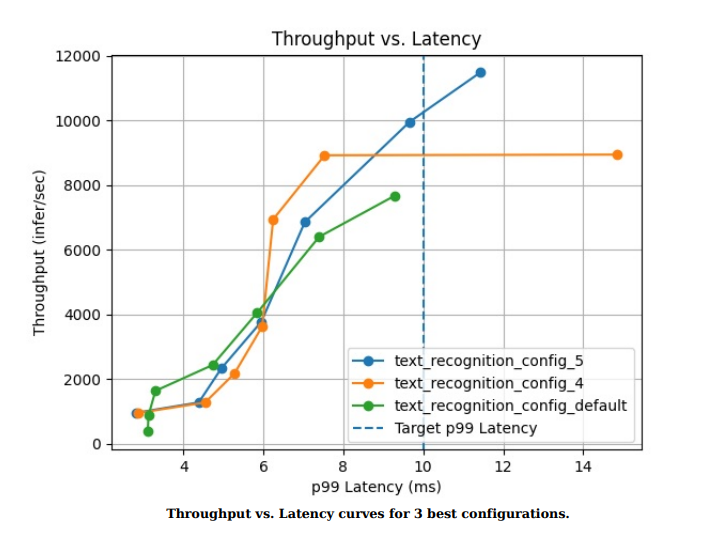
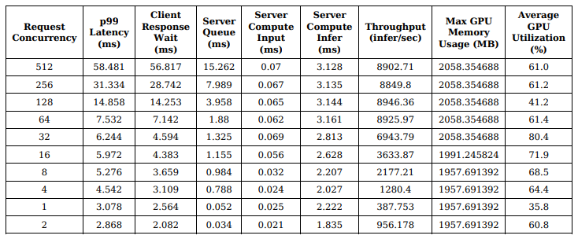

# 使用模型分析器自定义部署
| 导航到 | [第 2 部分：提高资源利用率](../Part_2-improving_resource_utilization/) | [第 4 部分：加速模型](../Part_4-inference_acceleration/) |
| ------------ | --------------- | --------------- |

每一次模型推理部署都会遇到一些它特有的挑战。这些挑战可能来自于服务级别协议中有关延迟维护的承诺、有限的硬件资源、个别模型的独特要求、请求的性质和数量、或者完全不同的其他因素等。此外，Triton Inference Server 具有许多功能，可以帮助它在内存消耗和性能之间进行权衡。

由于 Triton 存在大量的特性和需求，在每一次模型的部署中找到最佳配置，变成了一个可以通过扫描每个可能的配置来评估性能的任务。本讨论涵盖以下内容：
* 性能讨论
* 使用模型分析器寻找最佳配置

## 性能讨论

评估推理服务架构的性能是一个相当复杂的问题。这个复杂性源于 “运行推理” 只是谜题中的一部分。为了理解这一点，让我们来看看 Triton Inference Server 在启用动态批处理和使用多个模型实例的情况下，如何处理一个模型推理请求。


一旦客户端发来推理请求，Triton 的处理程序便将其放入所请求模型的队列中。一旦模型实例中有一个被释放，就会使用已接收的推理请求、其他正在传入的推理请求或者已经在队列中的推理请求形成一个动态批次，其大小与首选批次大小相对应。然后，将该批次转换为框架所需的格式，并发送到 Framework Runtime（PyTorch、TensorFlow、TensorRT 等）。推理结束后，这些结果将被返回给客户端。

在此过程中，延迟有三个主要因素：
* 网络延迟
* 推理计算时间
* 由于模型队列中的等待时间而导致的延迟

最小化**网络延迟**是一个具体问题具体分析的过程。让我们以算机视觉模型为例。这些模型使用图像帧、视频和点云等三维数据，这些数据可能非常大，因此需要更高的带宽来传输。大多数图像都以 float32 格式保存，它们可以被转换为 float16 格式。这可能会影响图像的动态范围，不过，模型的性能是否会受到影响，要看模型训练阶段预处理步骤所采用的方法，但肯定可以减少延迟，因为需要传输的数据较少。

加速模型以缩短有效**计算时间**，通常可以通过一系列技术实现，例如：通过融合层优化网络图，降低模型精度，融合内核等等。这个主题在本系列的 Part 4 中会更加深入地讨论。

**队列**中的延迟可以通过添加更多模型实例来解决。根据当前模型实例的 GPU 利用率，这可能需要额外的资源，也可能不需要。这是需要针对每个部署环境的特定情况具体解决的核心利用率问题。为了简化这一过程，Triton Inference Server 配备了模型分析器。

模型分析器是一个命令行工具，通过遍历不同的配置，并生成报告、总结性能，来帮助更好地了解 Triton Inference Server 模型的计算和内存要求。

使用模型分析器，用户可以：

* 运行可自定义的配置扫描以确定预期工作负载和硬件的最佳配置。
* 使用详细的报告、指标和图表，总结关于延迟、吞吐量、GPU 资源利用率、功耗等方面的调查结果。这些报告有助于比较不同配置之间的性能。
* 根据用户的服务质量要求，定制模型部署以满足特定的 p99 延迟限制 (p99是指 99% 的请求处理耗时) 、GPU内存利用率和最低吞吐量。

## 使用模型分析器

### 先决条件

请参考本系列的 Part 2 以获取模型。有关安装模型分析器的更多信息，请参考模型分析器[安装指南](https://github.com/triton-inference-server/model_analyzer/blob/main/docs/install.md#recommended-installation-method)。为了方便操作，请使用以下命令安装模型分析器：

```
sudo apt-get update && sudo apt-get install python3-pip
sudo apt-get update && sudo apt-get install wkhtmltopdf
pip3 install triton-model-analyzer
```

### 使用细节

在通过一个示例详细讨论之前，需要对 Model Analyzer 工具的总体功能和能力进行讨论，以了解如何最好地使用该工具。让我们开始讨论，关注对用户来说最重要的内容：为扫描设置目标 (`objectives`) 和约束 (`constraints`) 。

- **目标**: 用户可以根据部署目标、吞吐量、延迟或特定资源限制进行结果排序。[了解更多](https://github.com/triton-inference-server/model_analyzer/blob/main/docs/config.md#objective).

    Model Analyzer 有两种模式，在线模式和离线模式。在线模式下，用户可以为其部署指定延迟预算，以满足其需求。而在离线模式下，用户可以指定最低吞吐量。[了解更多](https://github.com/triton-inference-server/model_analyzer/blob/main/docs/cli.md#model-analyze-modes)。

- **约束条件**: 用户还可以选择根据吞吐量、延迟或GPU内存利用率的特定要求，限制扫描范围。 [了解更多](https://github.com/triton-inference-server/model_analyzer/blob/main/docs/config.md#constraint)

随着我们讨论更广泛的选择，让我们谈一谈用户在使用模型分析器时需要使用的两个关键子命令：分析 (`profile`) 和 报告 (`report`) 。尽管大多数命令的设置可以使用标记来设置，但有些需要构建一个配置文件。请参考文档中的[这一节](https://github.com/triton-inference-server/model_analyzer/blob/main/docs/config.md)以获得完整的设置列表。

- **分析**: `profile` 用于运行基准测试扫描。 在这里，用户可以指定扫描空间的详细信息，例如每个 GPU 的实例数量，模型的最大批次大小范围，最大 CPU 利用率，发送的推理请求的批次大小，发送给 Triton 的并发推理请求数量和[更多](https://github.com/triton-inference-server/model_analyzer/blob/main/docs/config.md#config-options-for-profile)。 `profile` 运行这些扫描，记录每个配置的性能，并保存运行的检查点。可以将这个步骤看作是运行大量实验并记录数据点以进行分析。该步骤需要 60-90 分钟才能完成。用户可以使用 `--run-config-search-mode quick` 标志来进行更快的扫描，减少配置数量。有关更多信息，或者如果需要更快和更小的扫描，请参阅[文档](https://github.com/triton-inference-server/model_analyzer/blob/main/docs/config.md#config-options-for-profile)。

- **报告**: `report` 子命令生成最佳配置的详细报告以及汇总报告。这些报告包含以下内容：
  - 一张图表，列出了发送到服务器的并发请求数量增加时的吞吐量和延迟情况。（详细情况）
  - GPU内存与延迟和GPU利用率与延迟的图表 (详细情况)
  - 一张表格，列出了在分析步骤中选择的最大并发请求数量（默认为 1024）下的 p99 延迟、延迟的各组成部分 、吞吐量、 GPU 利用率和 GPU 显存利用率。（详细情况）
  - 吞吐量与延迟图, GPU 内存与延迟图 ，并提供 1 张包含高层次细节的表格，用于比较最佳配置和用户选择的默认配置的差异。（摘要）

接下来看完下一节示例后，这些选择将更加清晰具体。

### 示例

考虑将文本识别模型（Part 1中的示例）部署时，使用`10 ms`的延迟预算。第一步是对模型进行分析。该命令初始化运行一个扫描并记录性能。

`model-analyzer profile --model-repository /path/to/model/repository --profile-models <name of the model> --triton-launch-mode=<launch mode: local/docker etc> --output-model-repository-path /path/to/output -f <path to config file> --run-config-search-mode quick`

注意：配置文件包含了推理请求图像的形状。请参考启动模式 [文档](https://github.com/triton-inference-server/model_analyzer/blob/main/docs/launch_modes.md)以了解有关启动模式标志的更多信息。

```
model-analyzer profile --model-repository /workspace/model_repository --profile-models text_recognition --triton-launch-mode=local --output-model-repository-path /workspace/output/ -f perf.yaml --override-output-model-repository --latency-budget 10 --run-config-search-mode quick
```

一旦扫描工作完成 ，用户可以使用 `report` 功能来总结出最重要的配置信息。

```
model-analyzer report --report-model-configs text_recognition_config_4,text_recognition_config_5,text_recognition_config_6 --export-path /workspace --config-file perf.yaml
```

有两类报告被生成：
* 摘要
* 详细报告

**摘要** 包含了所有最佳配置的总体结果。它包含正在使用的硬件信息，吞吐量与延迟曲线，GPU 显存与延迟曲线，以及 1 张包含性能数据和其他关键信息的表格。默认情况下，扫描空间仅限于少量的一些热门功能，如动态批处理和多模型实例，但用户可以通过[模型配置参数](https://github.com/triton-inference-server/model_analyzer/blob/main/docs/config.md#model-config-parameters)来扩展空间，以指定在 Triton 的配置文件中可以指定的任何功能。


**详细报告**将每个配置的性能进行了拆分。它们包含了更详细的性能图表，描述了不同负载下的性能指标。



样本报告可以在 `reports` 文件夹中找到。

# 下一步是什么？

在本教程中，我们介绍了模型分析器这个工具的使用，它能帮助用户根据资源利用率来选择最佳的部署配置。这是由 6 部分组成的教程系列的第 3 部分，该系列涵盖了将深度学习模型部署到生产环境时所面临的挑战。Part 4 将介绍 `推理加速` ，它将讨论框架级优化以加速您的模型！
