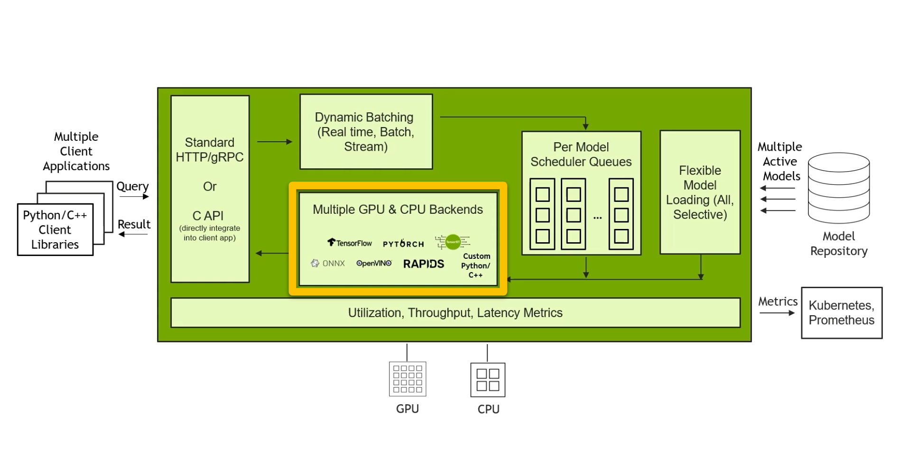
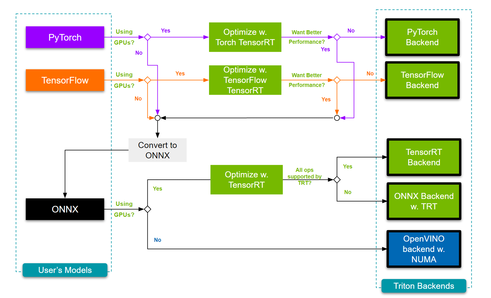
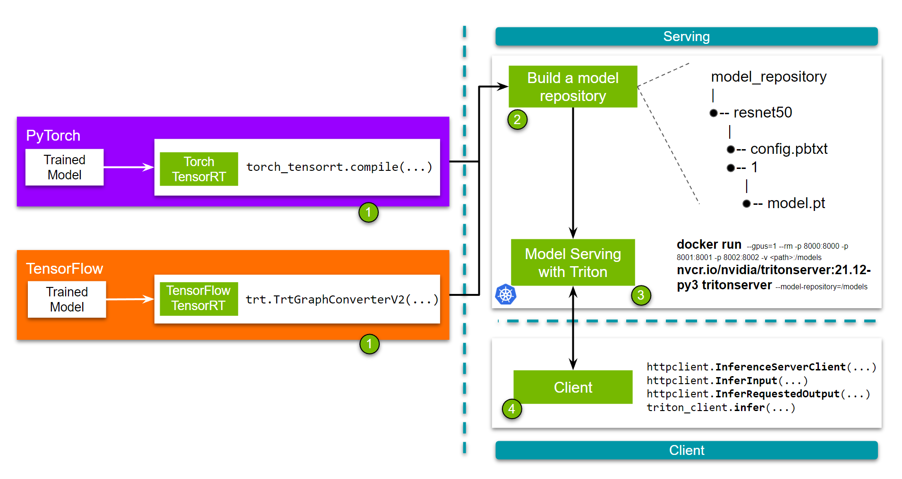

# 加速深度学习模型的推理

| 导航到 | [第 3 部分：优化 Triton 配置](../Part_3-optimizing_triton_configuration/)  | [第 5 部分：构建模型集合](../Part_5-Model_Ensembles/) |
| ------------ | --------------- | --------------- |

模型加速是一个复杂且微妙的话题。像模型图优化、剪枝、知识蒸馏、量化等技术的可行性，在很大程度上取决于模型的结构。这里的每一个主题，都涉及广泛的研究，若要构建定制化的模型加速工具，需要大量的工程投入。

为了简洁和客观起见，本次讨论将重点介绍在使用 Triton 推理服务器部署模型时建议使用的工具和功能，而不是对生态系统进行详尽的概述。



Triton Inference Server 有一个称为"Triton Backend" 或 ["后端"](https://github.com/triton-inference-server/backend)的概念。后端实际上是对模型推理的一个实现。后端可以是对深度学习框架（如 PyTorch、TensorFlow、TensorRT 或 ONNX Runtime 等）的封装，也可以是用户根据自己的模型和用例构建的自定义后端。每个后端都有自己特定的加速方法。

[这里](https://github.com/triton-inference-server/server/blob/main/docs/user_guide/performance_tuning.md)广泛讨论了 Triton Models 的性能调优，但本文档将在下面进行更深入地介绍。

采取何种加速策略，取决于两个因素：
* **硬件类型**: Triton 用户可以选择在 GPU 或 CPU 上运行模型。由于其并行性，GPU提供了许多性能加速的途径，使用 PyTorch、TensorFlow、ONNX runtime 和 TensorRT 的模型可以利用 GPU 的这些优势；对于CPU ，Triton 用户可以利用 OpenVINO 后端进行加速。
* **模型类型**: 通常，用户利用以下三种不同类别的模型中的一个或多个：浅层模型 (`Shallow models`) ，如随机森林；神经网络模型 (`Neural Networks`)，如 BERT 或 CNN；大模型(`Large Transformer Models`) ，通常因为太大而无法加载到单个 GPU 显存中。每个模型类别提高性能的方法都不一样。



在考虑了这些广泛的分类后，让我们深入挖掘具体的场景和决策过程，以选择最适合使用情况的 Triton 后端，并对可能的优化进行简要讨论。

## 基于 GPU 的加速

如前所述，我们可以通过多种方式实现深度学习模型的加速。图级优化，比如，模型层的融合，可以减少模型推理所需启动的 GPU 内核数量。而模型层的融合，使模型推理时，内存得到更加高效地利用，并增加了操作的密度。一旦融合，内核自动调整器可以选择正确的内核组合来最大化利用 GPU 资源。同样地，使用低精度（FP16，INT8 等）以及量化等技术，可以显着减少内存需求并提高吞吐量。

针对每一个型号的 GPU 所设计的性能优化策略，因硬件设计而各有不同，这让深度学习从业者面临诸多挑战。而英伟达推出的 [NVIDIA TensorRT](https://developer.nvidia.com/tensorrt)， 是一个专注于深度学习推理优化的 SDK，为我们解决这方面众多挑战中的一小部分。

TensorRT 与 PyTorch 、TensorFlow 、MXNET 、ONNX Runtime 等主流框架兼容，并且还在框架级别上与 PyTorch ([Torch-TensorRT](https://github.com/pytorch/TensorRT)) 和 TensorFlow ([TensorFlow-TensorRT](https://github.com/tensorflow/tensorrt)) 进行了集成，以提供给各自开发者更灵活和可回退的机制（下文会详细介绍回退机制）。

### 直接使用 TensorRT

用户可通过以下三种途径，将其模型转换为 TensorRT ：C++ API 、Python API 和 [trtexec](https://github.com/NVIDIA/TensorRT/tree/main/samples/trtexec)/[polygraphy](https://github.com/NVIDIA/TensorRT/tree/main/tools/Polygraphy)（TensorRT 的命令行工具）。[请参考本指南中的详细示例](https://github.com/NVIDIA/TensorRT/tree/main/quickstart/deploy_to_triton)。

也就是说，有两个主要步骤需要完成。首先，将模型转换为 TensorRT 引擎。建议使用 [TensorRT 容器](https://catalog.ngc.nvidia.com/orgs/nvidia/containers/tensorrt)来运行该命令。

```
trtexec --onnx=model.onnx \
        --saveEngine=model.plan \
        --explicitBatch
```

一旦转换完成，请将模型放置在模型仓库中的 `model.plan` 文件中（如 Part 1 所述），并在 `config.pbtxt` 文件中，指定 `tensorrt` 作为 `backend` 。

除了将模型转换为 TensorRT 之外，用户还可以利用一些 [CUDA 特定的优化](https://github.com/triton-inference-server/common/blob/d4017443199e4f19462360789f5c80b0eb1e4738/protobuf/model_config.proto#L823) 。

你的模型中，可能会有一些 TensorRT 不支持的算子，有三种解决问题的方法：
* **使用其中一种框架集成**: TensorRT 有两个与框架的集成：Torch-TensorRT (PyTorch) 和 TensorFlow-TensorRT (TensorFlow) 。这些集成内置了一个回退机制，在 TensorRT 不直接支持计算图的情况下，使用框架后端。

* **使用带有 TensorRT 的 ONNX Runtime**: Triton 用户可以使用 ONNX Runtime 来利用这种回退机制（更多细节请参见下一节）。

* **编写一个插件**: TensorRT 允许用户构建插件和实现自定义算子。用户可以编写自己的 [TensorRT 插件](https://docs.nvidia.com/deeplearning/tensorrt/developer-guide/index.html#extending)来实现不支持的算子（建议专家用户使用）。强烈鼓励报告这些算子 ，以便 TensorRT 能够本身支持这些算子。

### 使用 TensorRT 与 PyTorch/TensorFlow 的集成
与 **PyTorch** 集成的情况：Torch-TensorRT 是一种 AOT 编译器（区别于 JIT 即时编译器），它将 TorchScript / Torch FX 转换为 TensorRT Engine 。在编译完成后，用户可以像使用 TorchScript 模型一样使用优化后的模型。查看使用Torch TensorRT [入门](https://www.youtube.com/watch?v=TU5BMU6iYZ0)了解更多信息。[参考这个指南,获取一个详细的示例](https://pytorch.org/TensorRT/tutorials/serving_torch_tensorrt_with_triton.html)，了解使用 Torch TensorRT 编译 PyTorch 模型并在 Triton 上部署。

与 **TensorFlow** 集成的情况：TensorFlow 用户可以使用 TensorFlow TensorRT ，它将图分割成 TensorRT 支持的子图和不支持的子图。然后，支持的子图被 TensorRT 优化节点替换，生成一个同时包含 TensorFlow 和 TensorRT 组件的计算图 (graph) 。[请参考这个教程](https://github.com/tensorflow/tensorrt/tree/master/tftrt/triton)，了解如何通过 TensorFlow-TensorRT 加速模型，并在 Triton Inference Server 上部署。



### 使用 TensorRT 与 ONNX RunTime 的集成

有三种选项可以加速 ONNX runtime：使用 `TensorRT` 和 `CUDA` execution providers 加速 GPU 上的推理；使用 OpenVINO 加速 CPU 上的执行（在后续章节中讨论）。

通常情况下，TensorRT 要比 CUDA execution provider 优化得更好，然而，这还是要取决于模型的确切结构，更准确地说，取决于在被加速的网络中使用的算子。如果所有算子都能得到支持，转换为 TensorRT 将获得更好的性能。当选择 `TensorRT` 作为加速器时，所有支持的子图都由 TensorRT 加速，剩余的图由 CUDA Execution Provider 运行。用户可以通过在配置文件中添加以下内容来实现这一点。

**TensorRT 加速**
```
optimization {
  execution_accelerators {
    gpu_execution_accelerator : [ {
      name : "tensorrt"
      parameters { key: "precision_mode" value: "FP16" }
      parameters { key: "max_workspace_size_bytes" value: "1073741824" }
    }]
  }
}
```
话虽如此，用户还可以选择在没有 TensorRT 优化的情况下运行模型，此时 CUDA EP 是默认的执行程序。更多详细信息可以在[这里](https://github.com/triton-inference-server/onnxruntime_backend#onnx-runtime-with-tensorrt-optimization)找到。有关 Part 1 - Part 3 部分中使用的`Text Recognition`模型的示例配置文件，请参考这里的  `onnx_tensorrt_config.pbtxt` 。

还有一些其他针对 ONNX RunTime 的特定优化，请参考 [ONNX backend 文档](https://github.com/triton-inference-server/onnxruntime_backend#other-optimization-options-with-onnx-runtime) 以获取更多信息。

## 基于 CPU 的加速
Triton Inference Server 还支持使用 [OpenVINO](https://docs.openvino.ai/latest/index.html) 加速仅使用 CPU 的模型。要启用 CPU 加速，请在配置文件中添加以下内容。
```
optimization {
  execution_accelerators {
    cpu_execution_accelerator : [{
      name : "openvino"
    }]
  }
}
```
OpenVINO 提供了软件层面的优化，但 CPU 硬件层面的考量也很重要。CPU 由多个核心、内存资源和互连组件组成，在多个 CPU 上，这些资源可以通过 NUMA（非统一内存访问）进行共享。请参考 [Triton 文档的这部分](https://github.com/triton-inference-server/server/blob/main/docs/optimization.md#numa-optimization) 获取更多信息。

## 加速浅模型
浅层模型，例如 GBDT（Gradient Boosting Decision Tree，即梯度提升决策树），经常被用于许多 Pipelines 当中。这些模型通常使用诸如 [XGBoost](https://xgboost.readthedocs.io/en/stable/) [LightGBM](https://lightgbm.readthedocs.io/en/v3.3.2/) 、[Scikit-learn](https://scikit-learn.org/stable/) [cuML](https://github.com/rapidsai/cuml) 等库构建。通过 Forest Inference Library 后端，这些模型就可以部署在 Triton Inference Server 上。请查看[这些示例](https://github.com/triton-inference-server/fil_backend/tree/main/notebooks)以获取更多信息。

## 加速大模型
另一方面，深度学习从业者对具有数十亿甚至更多参数的 Large Transformer 趋之若鹜。针对那种规模的模型，通常需要不同类型的优化，或 在多个 GPU 上进行并行化。这种跨 GPU 的并行化（因为它们很可能无法被加载到一个 GPU 上）可以通过 张量并行 (Tensor parallelism) 或 流水线并行 (Pipeline parallelism) 来实现。为了解决这个问题，用户可以使用 [Faster Transformer Library](https://github.com/NVIDIA/FasterTransformer/) 和 Triton [Faster Transformer Backend](https://github.com/triton-inference-server/fastertransformer_backend)。[请访问此博客](https://developer.nvidia.com/blog/accelerated-inference-for-large-transformer-models-using-nvidia-fastertransformer-and-nvidia-triton-inference-server/)获取更多信息！

## 示例
在继续之前，请为本系列第 1-3 部分中使用的文本识别模型设置一个模型存储库。然后，切换到模型仓库，并启动两个容器。

```
# Server Container
docker run --gpus=all -it --shm-size=256m --rm -p8000:8000 -p8001:8001 -p8002:8002 -v$(pwd):/workspace/ -v/$(pwd)/model_repository:/models nvcr.io/nvidia/tritonserver:22.11-py3 bash

# Client Container (on a different terminal)
docker run -it --net=host -v ${PWD}:/workspace/ nvcr.io/nvidia/tritonserver:22.11-py3-sdk bash
```

由于这个模型被转换成 ONNX 模型，并且在上述的介绍中链接了 TensorRT 加速示例，因此我们将沿着这个方向探索 ONNX 的例子。在使用 ONNX 后端时，有三种情况需要考虑：
* 使用 CUDA EP 加速 GPU 上的 ONNX RunTime模型推理: `ORT_cuda_ep_config.pbtxt`
* 使用TRT加速GPU上的 ONNX RunTime 模型推理: `ORT_TRT_config.pbtxt`
* 使用 OpenVINO 加速 CPU 上的 ONNX RunTime 模型执行: `ORT_openvino_config.pbtxt`

在使用 ONNX RunTime 时，有一些[通用的优化](https://github.com/triton-inference-server/onnxruntime_backend#other-optimization-options-with-onnx-runtime)可以考虑，不管使用的 EP ( Execution Provider ) 是什么。这些可以是图级别的优化，也可以是选择用于并行执行的线程数量和方式，或者一些内存使用的优化。这些优化的使用，很大程度上取决于你要部署的模型。

如上所述，让我们使用合适的配置文件来启动 Triton Inference Server 。

```
tritonserver --model-repository=/models
```
**注意: 这些基准测试只是为了说明性能提升的一般曲线。这不是通过 Triton 可获得的最高吞吐量，因为尚未启用提升资源利用率的功能（例如动态批处理）。请参阅模型分析器教程，了解模型优化完成后的最佳部署配置。**

**注意**: 这些设置是为了最大限度地提高吞吐量。请参阅模型分析器教程，其中介绍了如何管理延迟要求。

作为参考，基准性能如下：
```
Inferences/Second vs. Client Average Batch Latency
Concurrency: 2, throughput: 4191.7 infer/sec, latency 7633 usec
```

### 使用 CUDA EP 加速 GPU 上的 ONNX RunTime 模型推理

对于这个模型，我们启用了对最佳卷积算法的穷尽搜索  。[了解更多配置选项](https://github.com/triton-inference-server/onnxruntime_backend#onnx-runtime-with-cuda-execution-provider-optimization)。

```
## Additions to Config
parameters { key: "cudnn_conv_algo_search" value: { string_value: "0" } }
parameters { key: "gpu_mem_limit" value: { string_value: "4294967200" } }

## Perf Analyzer Query
perf_analyzer -m text_recognition -b 16 --shape input.1:1,32,100 --concurrency-range 64
...
Inferences/Second vs. Client Average Batch Latency
Concurrency: 2, throughput: 4257.9 infer/sec, latency 7672 usec
```

### 使用 TRT 加速 GPU 上的 ONNX RunTime 模型推理
在指定 TensorRT EP 时，如果 TensorRT 不支持某些算子 ，Triton 则会将 CUDA EP 作为一个回退来处理这些算子。如果 TensorRT 支持所有算子，则建议直接使用 TensorRT 原生能力，因为其性能提升和优化选项会更好。这里，TensorRT 加速器使用了 `FP16` 精度。

```
## Additions to Config
optimization {
  graph : {
    level : 1
  }
 execution_accelerators {
    gpu_execution_accelerator : [ {
      name : "tensorrt",
      parameters { key: "precision_mode" value: "FP16" },
      parameters { key: "max_workspace_size_bytes" value: "1073741824" }
    }]
  }
}

## Perf Analyzer Query
perf_analyzer -m text_recognition -b 16 --shape input.1:1,32,100 --concurrency-range 2
...
Inferences/Second vs. Client Average Batch Latency
Concurrency: 2, throughput: 11820.2 infer/sec, latency 2706 usec
```

### 使用 OpenVINO 加速 CPU 上的 ONNX RunTime 模型执行

Triton 用户还可以使用 OpenVINO 进行 CPU 部署。可以通过以下方式启用：

```
optimization { execution_accelerators {
  cpu_execution_accelerator : [ {
    name : "openvino"
  } ]
}}
```
1 CPU 对比 1 GPU ，这种前后性能的比较不太公平。所以，我们建议用户在本地的 CPU 硬件上进行基准测试。[了解更多信息](https://github.com/triton-inference-server/onnxruntime_backend#onnx-runtime-with-openvino-optimization)。

每个后端都有许多其他功能，可以根据特定模型的需求进行启用。请参考[protobuf](https://github.com/triton-inference-server/common/blob/main/protobuf/model_config.proto) ，了解功能和优化的完整列表。

## 模型导航工具

上面介绍了转换模型和使用不同加速器的方法，并提供了一个 “一般指南”，主要帮你构建对模型优化路径的直觉。这些都是纯手工摸索的，比较耗时间。为了检查覆盖范围，并探索可能的优化子集  ，用户可以使用[模型导航工具](https://github.com/triton-inference-server/model_navigator)。

# 下一步是什么？

在本教程中，我们介绍了大量的优化选项，用来在使用 Triton Inference Server 时加速模型。这是本教程系列的 Part 4 （共有 6 部分），介绍了在生产环境中部署深度学习模型时所面临的挑战。Part 5 将介绍`Building a model ensemble`。Part 3 和 Part 4 分别关注了资源利用和框架级模型加速。同时使用这两种技术将带来最佳性能。由于具体选择高度依赖于工作负载、模型、SLAs 和硬件资源，因此这个过程对于每个用户都有所不同。强烈建议用户尝试使用所有这些功能，以找到适合他们用例的最佳部署配置。