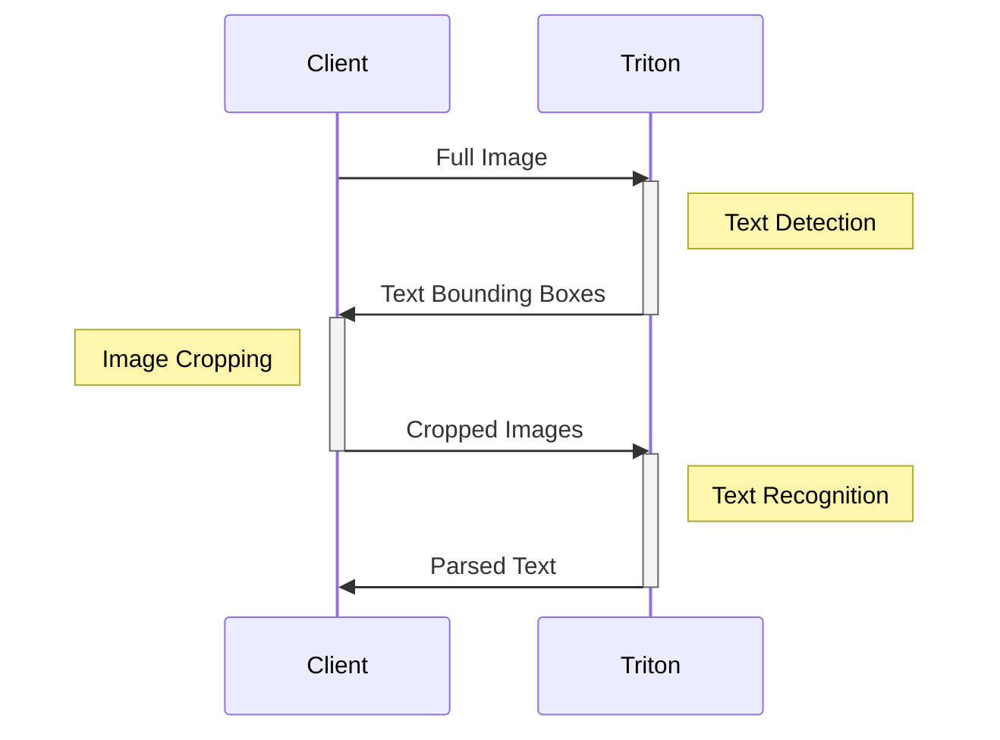
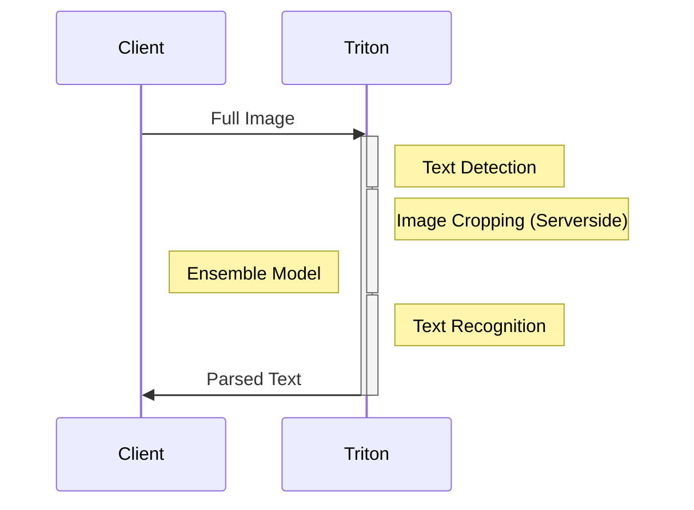
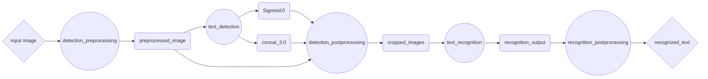

# 使用模型集成执行多个模型

| 导航到 | [	第 4 部分：加速模型](../Part_4-inference_acceleration/)  | [第 6 部分：使用 BLS API 构建复杂的管道](../Part_6-building_complex_pipelines/) | [文档：Ensembles](https://docs.nvidia.com/deeplearning/triton-inference-server/user-guide/docs/user_guide/architecture.html#ensemble-models)
| ------------ | --------------- | --------------- | --------------- |

现代机器学习系统通常涉及多个模型的执行，无论是因为预处理和后处理步骤、聚合多个模型的预测，还是让不同的模型执行不同的任务。在此示例中，我们将探索单个网络请求下，如何使用模型集成在服务端侧执行多个模型推理。这样做的好处是，可减少客户端和服务器之间数据的交换次数，并消除一些网络调用带来的延迟。

为了说明创建模型集成的过程，我们将复用 [Part 1](../Part_1-model_deployment/README_zh-CN.md) 中介绍的模型流水线的例子。在前面的例子中，我们分别调用了文本检测模型和文本识别模型，它在客户端执行了两次网络调用，并执行了各种处理步骤，包括图片裁剪、图像大小调整、张量解码等。下面是一个简化的流程图，其中一些步骤在客户端上执行，一些步骤在服务端上执行。



为了减少网络调用和数据交换次数（并且利用可能更强大的服务器来执行 PRE/POST 处理），我们可以使用 Triton 的[模型集成](https://docs.nvidia.com/deeplearning/triton-inference-server/user-guide/docs/user_guide/architecture.html#ensemble-models) 功能 ，在一次网络调用中执行多个模型推理。


让我们来看下，如何创建一个Triton的模型集成。

**注意:** 如果你想找一个例子来理解数据是如何在模型集成中流动的, [请参阅本教程](../../Feature_Guide/Data_Pipelines/README.md)!

## 部署基本模型
第一步是将文本检测和文本识别模型部署为常规的 Triton 模型，就像我们过去所做的那样。有关将模型部署到 Triton 的详细概述，请参阅本教程的[Part 1](../Part_1-model_deployment/README.md)。为方便起见，我们提供了两个用于导出这些模型的 shell 脚本。

>注意：我们建议在 NGC TensorFlow 容器环境中执行以下步骤，你可以使用以下命令来启动`docker run -it --gpus all -v ${PWD}:/workspace nvcr.io/nvidia/tensorflow:<yy.mm>-tf2-py3`
```bash
bash utils/export_text_detection.sh
```

>注意：我们建议在 NGC PyTorch 容器环境中执行以下步骤，你可以使用以下命令来启动`docker run -it --gpus all -v ${PWD}:/workspace nvcr.io/nvidia/pytorch:<yy.mm>-py3`
```bash
bash utils/export_text_recognition.sh
```

## 使用 Python Backend 部署 Pre/Post 处理脚本
在本教程的前几部分中，我们创建了客户端脚本，用于在客户端进程中执行各种预处理和后处理步骤。例如，在[Part 1](../Part_1-model_deployment/README.md)中，我们创建了一个脚本[`client.py`](../Part_1-model_deployment/clients/client.py),流程如下：
1. 读取图像
2. 对图像执行缩放和归一化
3. 发送图像到 Triton 服务器
4. 根据文本检测模型返回的边界框裁剪图像
5. 将裁剪后的图像保存回磁盘

然后，我们创建了第二个客户端脚本 [`client2.py`](../Part_1-model_deployment/clients/client2.py)，它是这样的流程：
1. 读取通过`client.py`裁剪好的图片
2. 对图像执行缩放和归一化
3. 将裁剪后的图像发送到 Triton 服务器
4. 将文本识别模型返回的张量解码为文本
5. 打印解码的文本

为了将其中许多步骤移动到 Triton 服务器，我们可以创建一组脚本，让它们运行在[Triton 的 Python 后端](https://github.com/triton-inference-server/python_backend)。Python 后端可以执行任何 Python 代码，因此我们只需进行少量修改，就可以将客户端脚本直接移植到 Triton 。

为了在 Python 后端部署模型，需要在模型存储库中创建一个目录，如下所示（ `my_python_model` 可以被任意命名）：

```
my_python_model/
├── 1
│   └── model.py
└── config.pbtxt
```

我们将创建3个不同的 python 后端模型，与现有的 ONNX 模型配合，使用 Triton 来对外提供服务。
1. `detection_preprocessing`
2. `detection_postprocessing`
3. `recognition_postprocessing`

您可以在 `model_repository` 文件夹中找到每个模型的完整 `model.py` 脚本。

让我们来看一个例子：在 `model.py` 中，我们创建了一个名为 `TritonPythonModel` 的类定义，其中包含以下方法：

```python
class TritonPythonModel:
    def initialize(self, args):
        ...
    def execute(self, requests):
        ...
    def finalize(self):
        ...
```
`initialize`和`finalize`方法是可选的，它们在模型加载和卸载时分别被调用。大部分逻辑将放在 `execute` 方法中，该方法接受一个请求对象 _列表_ ，并且必须返回一个响应对象列表。

在我们原来的客户端中，我们有以下代码来读取一张图片并对其进行一些简单的转换：

```python
### client.py

image = cv2.imread("./img1.jpg")
image_height, image_width, image_channels = image.shape

# Pre-process image
blob = cv2.dnn.blobFromImage(image, 1.0, (inpWidth, inpHeight), (123.68, 116.78, 103.94), True, False)
blob = np.transpose(blob, (0, 2,3,1))

# Create input object
input_tensors = [
    httpclient.InferInput('input_images:0', blob.shape, "FP32")
]
input_tensors[0].set_data_from_numpy(blob, binary_data=True)
```

在 Python 后端执行时，我们需要确保我们的代码可以处理输入列表。此外，我们不会从磁盘中读取图像——相反，我们将直接从 Triton Server 提供的输入张量中检索它们。

```python
### model.py

responses = []
for request in requests:
    # Read input tensor from Triton
    in_0 = pb_utils.get_input_tensor_by_name(request, "detection_preprocessing_input")
    img = in_0.as_numpy()
    image = Image.open(io.BytesIO(img.tobytes()))

    # Pre-process image
    img_out = image_loader(image)
    img_out = np.array(img_out)*255.0

    # Create object to send to next model
    out_tensor_0 = pb_utils.Tensor("detection_preprocessing_output", img_out.astype(output0_dtype))
    inference_response = pb_utils.InferenceResponse(output_tensors=[out_tensor_0])
    responses.append(inference_response)
return responses
```


## 使用模型集成将模型连接起来
现在，Pipline 中的每个独立环节都准备就绪，我们可以创建一个集成“模型”，该集成“模型”可以按顺序执行每个模型，并在每个模型之间传递各种输入和输出。

为了做到这一点，我们将在模型库中创建另一个条目。
To do this, we'll create another entry in our model repository
```
ensemble_model/
├── 1
└── config.pbtxt
```
这一次，我们只需要配置文件来描述我们的集合以及一个空的版本文件夹（您需要创建该文件夹）。在配置文件中，我们将定义集成的执行图。该图描述了集成的整体输入和输出，以及数据将如何以有向无环图的形式流过模型。下面是模型管道的图形表示。菱形代表整体的最终输入和输出，这是客户将与之交互的全部内容。圆圈是不同的部署模型，矩形是在模型之间传递的张量

这次，我们只需要配置文件来描述我们的集成模型，以及一个空的版本文件夹（需要使用 `mkdir -p model_repository/ensemble_model/1` 命令创建）。在配置文件中，我们将定义集成“模型”的执行图。该图描述了集成“模型”的整体输入和输出，以及数据将如何以有向无环图的形式在模型之间流动。下面用图形表示我们的模型流水线 。菱形代表集成“模型”的最终输入和输出，这是客户端将与之交互的全部内容。圆圈代表不同的部署模型，矩形代表在模型之间传递的张量。



为了用 Triton 来描述这个图，我们将创建以下配置文件。请注意，我们如何将平台指定为 `"ensemble"`，并指定了 `"ensemble"` 本身的输入和输出。然后，在 `ensemble_scheduling` 模块中，我们为集成的每个`step`创建一个条目 ，这些条目包括要执行的模型的名称 、该模型的输入和输出，以及他们如何映射到 " ensemble " 或其他模型。

<details>
<summary> 展开集成配置文件 </summary>

```text proto
name: "ensemble_model"
platform: "ensemble"
max_batch_size: 256
input [
  {
    name: "input_image"
    data_type: TYPE_UINT8
    dims: [ -1 ]
  }
]
output [
  {
    name: "recognized_text"
    data_type: TYPE_STRING
    dims: [ -1 ]
  }
]

ensemble_scheduling {
  step [
    {
      model_name: "detection_preprocessing"
      model_version: -1
      input_map {
        key: "detection_preprocessing_input"
        value: "input_image"
      }
      output_map {
        key: "detection_preprocessing_output"
        value: "preprocessed_image"
      }
    },
    {
      model_name: "text_detection"
      model_version: -1
      input_map {
        key: "input_images:0"
        value: "preprocessed_image"
      }
      output_map {
        key: "feature_fusion/Conv_7/Sigmoid:0"
        value: "Sigmoid:0"
      },
      output_map {
        key: "feature_fusion/concat_3:0"
        value: "concat_3:0"
      }
    },
    {
      model_name: "detection_postprocessing"
      model_version: -1
      input_map {
        key: "detection_postprocessing_input_1"
        value: "Sigmoid:0"
      }
      input_map {
        key: "detection_postprocessing_input_2"
        value: "concat_3:0"
      }
      input_map {
        key: "detection_postprocessing_input_3"
        value: "preprocessed_image"
      }
      output_map {
        key: "detection_postprocessing_output"
        value: "cropped_images"
      }
    },
    {
      model_name: "text_recognition"
      model_version: -1
      input_map {
        key: "INPUT__0"
        value: "cropped_images"
      }
      output_map {
        key: "OUTPUT__0"
        value: "recognition_output"
      }
    },
    {
      model_name: "recognition_postprocessing"
      model_version: -1
      input_map {
        key: "recognition_postprocessing_input"
        value: "recognition_output"
      }
      output_map {
        key: "recognition_postprocessing_output"
        value: "recognized_text"
      }
    }
  ]
}
```

</details>

## 启动 Triton
我们将再次使用 Docker 容器来启动 Triton 。这一次，我们将在容器内部启动一个交互式会话，而不是直接启动 Triton Server 。

```bash
docker run --gpus=all -it --shm-size=256m --rm  \
  -p8000:8000 -p8001:8001 -p8002:8002 \
  -v ${PWD}:/workspace/ -v ${PWD}/model_repository:/models \
  nvcr.io/nvidia/tritonserver:22.12-py3
```

我们需要为我们的 Python 后端脚本安装一些依赖项。

```bash
pip install torchvision opencv-python-headless
```

然后，才能启动 Triton
```bash
tritonserver --model-repository=/models
```

## 创建一个新的客户端 

现在，我们已经将以前客户端中许多复杂处理转移到不同的 Triton 后端脚本中，我们终于可以用更优雅、更简洁地方式，创建一个客户端与 Triton 进行通信。

```python
## client.py

import tritonclient.grpc as grpcclient
import numpy as np

client = grpcclient.InferenceServerClient(url="localhost:8001")

image_data = np.fromfile("img1.jpg", dtype="uint8")
image_data = np.expand_dims(image_data, axis=0)

input_tensors = [grpcclient.InferInput("input_image", image_data.shape, "UINT8")]
input_tensors[0].set_data_from_numpy(image_data)
results = client.infer(model_name="ensemble_model", inputs=input_tensors)
output_data = results.as_numpy("recognized_text").astype(str)
print(output_data)
```

现在，通过执行以下命令来运行完整的推理流程。
```
python client.py
```
然后，你就能在服务端控制台中看到解析的文本。

## 后续步骤
在本教程中，我们展示了如何使用模型集成在 Triton 上执行多个模型，且仅需一次网络调用。当您的模型流水线以有向无环图的形式存在时，模型集成是一个很好的解决方案。然而，并不是所有的模型流水线都可以用这种方式表达。例如，如果你的模型流水线逻辑需要条件分支或循环执行，那么，你可能需要一种更具表达能力的方式来定义你的模型流水线。在[下一个示例](../Part_6-building_complex_pipelines/)中，我们将探索如何使用 [Business Logic Scripting](https://github.com/triton-inference-server/python_backend#business-logic-scripting) （业务逻辑脚本） 来在 Python 中定义更复杂的流水线。