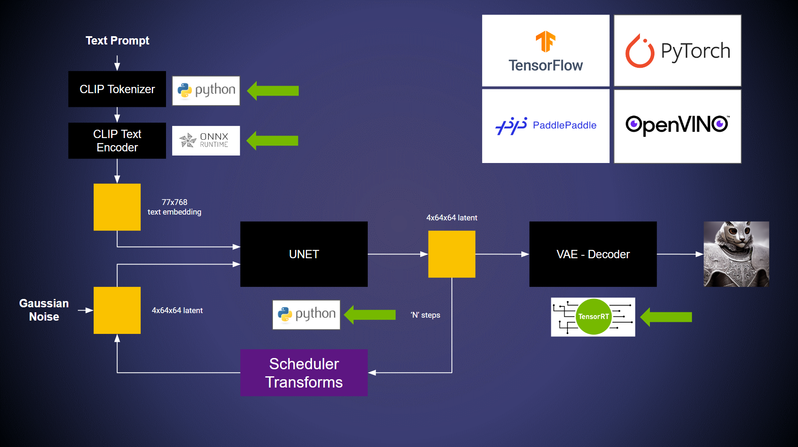

# 构建复杂的流水线: Stable Diffusion

| 导航到 | [第 5 部分：构建模型集合](../Part_5-Model_Ensembles/)  | [文档：BLS](https://github.com/triton-inference-server/python_backend#business-logic-scripting) |
| ------------ | --------------- | --------------- |

**在继续示例之前，请观看[此官方讲解视频](https://youtu.be/JgP2WgNIq_w)，其中讨论了流水线。**. 这个示例主要展示了 Tensor Inference Server 的两个功能:
* 在同一推理流水线中使用多个框架。 有关支持框架的更多信息，参阅 [这里](https://github.com/triton-inference-server/backend#where-can-i-find-all-the-backends-that-are-available-for-triton)。
* 使用 Python 后端的[业务逻辑脚本（Business Logic Scripting）](https://github.com/triton-inference-server/python_backend#business-logic-scripting)API 构建复杂的非线性管道。

## 使用多种后端

建立一个由深度学习模型驱动的流水线是一项协作工作，通常涉及多个贡献者。贡献者通常具有不同的开发环境。这可能会导致在使用来自不同贡献者的工作构建单个管道时出现问题。Triton 用户可以使用 Python 或 C++ 后端以及业务逻辑脚本（BLS）API 来触发模型执行，从而解决这一挑战。



在这个例子中，模型运行的后端包括：
* ONNX Backend
* TensorRT Backend
* Python Backend

可以使用以下 API 执行部署在框架后端的两个模型：
```
encoding_request = pb_utils.InferenceRequest(
    model_name="text_encoder",
    requested_output_names=["last_hidden_state"],
    inputs=[input_ids_1],
)

response = encoding_request.exec()
text_embeddings = pb_utils.get_output_tensor_by_name(response, "last_hidden_state")
```

请参考`pipeline`模型中的 `model.py` ，更完整地了解示例。

## Stable Diffusion 示例

在开始之前，请克隆此存储库并导航到根目录。使用三个不同的终端以获得更轻松的用户体验。

### 步骤 1：准备服务器环境
* 首先，运行 Triton 推理服务器容器。
```
# Replace yy.mm with year and month of release. Eg. 22.08
docker run --gpus=all -it --shm-size=256m --rm -p8000:8000 -p8001:8001 -p8002:8002 -v ${PWD}:/workspace/ -v ${PWD}/model_repository:/models nvcr.io/nvidia/tritonserver:yy.mm-py3 bash
```
* 接下来，安装运行在 python 后端的模型所需的所有依赖项，并使用您的 [huggingface 令牌](https://huggingface.co/settings/tokens)登录（需要 [HuggingFace](https://huggingface.co/) 帐户）。

```
# PyTorch & Transformers Lib
pip install torch torchvision torchaudio
pip install transformers ftfy scipy accelerate
pip install diffusers==0.9.0
pip install transformers[onnxruntime]
huggingface-cli login
```

### 第 2 步：导出和转换模型
使用 NGC PyTorch 容器导出和转换模型。

```
docker run -it --gpus all -p 8888:8888 -v ${PWD}:/mount nvcr.io/nvidia/pytorch:yy.mm-py3

pip install transformers ftfy scipy
pip install transformers[onnxruntime]
pip install diffusers==0.9.0
huggingface-cli login
cd /mount
python export.py

# Accelerating VAE with TensorRT
trtexec --onnx=vae.onnx --saveEngine=vae.plan --minShapes=latent_sample:1x4x64x64 --optShapes=latent_sample:4x4x64x64 --maxShapes=latent_sample:8x4x64x64 --fp16

# Place the models in the model repository
mkdir model_repository/vae/1
mkdir model_repository/text_encoder/1
mv vae.plan model_repository/vae/1/model.plan
mv encoder.onnx model_repository/text_encoder/1/model.onnx
```

### 第 3 步：启动服务器
从服务器容器中，启动 Triton 推理服务器。
```
tritonserver --model-repository=/models
```

### 步骤 4：运行客户端
使用客户端容器运行客户端。
```
docker run -it --net=host -v ${PWD}:/workspace/ nvcr.io/nvidia/tritonserver:yy.mm-py3-sdk bash

# Client with no GUI
python3 client.py

# Client with GUI
pip install gradio packaging
python3 gui/client.py --triton_url="localhost:8001"
```
注意：第一次推理查询可能比后面的查询花费更多时间
