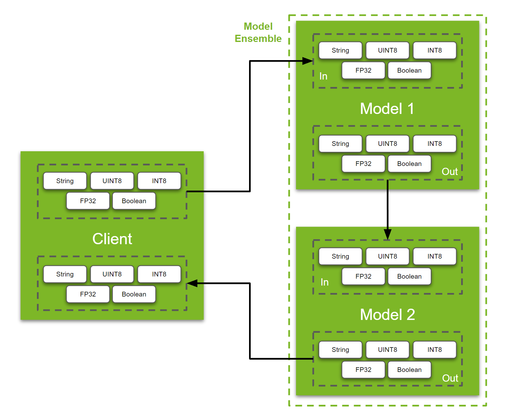

# 了解数据管道

学习如何将张量从客户端移动到后端，或在后端之间移动张量是Triton用户需要构建的核心技能。在本教程中，我们将介绍以下内容：

* 用于在客户端和服务器之间移动数据的 API
* 如何熟练使用集成调度器

**注意:** 此示例假定读者对如何使用Triton Inference Server有基本的了解。如果您不熟悉Triton Inference Server，请在继续操作之前参阅[概念指南的第1部分](https://github.com/triton-inference-server/tutorials/tree/main/Conceptual_Guide/Part_1-model_deployment)。

## 虚拟管道概述

要移动的数据类型取决于要构建的管道类型。因此，没有一个清晰的实际示例可以用于迎合广大受众。因此，本教程将简单地演示如何通过虚拟管道移动 String、UINT8 和 INT8 数组、FP32 图像和布尔值。

<p align="center" width="100%">
    
</p>

### 设置模型和集成

在我们进一步讨论之前，让我们先建立模型。为了这个演示，我们使用了一个[“Python模型”](https://github.com/triton-inference-server/python_backend#python-backend)。Triton中的Python模型基本上是具有三个Triton特定功能的类：`initialize`、`execute`和`finalize`。用户可以自定义这个类，以服务于他们编写的任何Python函数或他们想要的任何模型，只要它可以在Python运行时加载。`initialize`函数在python模型加载到内存中时运行，`finalize`函数在模型从内存中卸载时运行。这两个函数都是可选的。同样，为了使这个例子简单明了，我们将只使用`execute`函数来打印它们通过“Python模型”接收到的张量。让我们来看看它是如何完成的：

```
def execute(self, requests):
    responses = []
    for request in requests:
        inp = pb_utils.get_input_tensor_by_name(request, "model_1_input_string")
        inp2 = pb_utils.get_input_tensor_by_name(request, "model_1_input_UINT8_array")
        inp3 = pb_utils.get_input_tensor_by_name(request, "model_1_input_INT8_array")
        inp4 = pb_utils.get_input_tensor_by_name(request, "model_1_input_FP32_image")
        inp5 = pb_utils.get_input_tensor_by_name(request, "model_1_input_bool")

        print("Model 1 received", flush=True)
        print(inp.as_numpy(), flush=True)
        print(inp2.as_numpy(), flush=True)
        print(inp3.as_numpy(), flush=True)
        print(inp4.as_numpy(), flush=True)
        print(inp5.as_numpy(), flush=True)

        inference_response = pb_utils.InferenceResponse(output_tensors=[
            pb_utils.Tensor(
                "model_1_output_string",
                inp.as_numpy(),
            ),
            pb_utils.Tensor(
                "model_1_output_UINT8_array",
                inp2.as_numpy(),
            ),
            pb_utils.Tensor(
                "model_1_output_INT8_array",
                inp3.as_numpy(),
            ),
            pb_utils.Tensor(
                "model_1_output_FP32_image",
                inp4.as_numpy(),
            ),
            pb_utils.Tensor(
                "model_1_output_bool",
                inp5.as_numpy(),
            )
        ])
        responses.append(inference_response)
    return responses
```

在这种情况下，有两个关键点需要注意：`pb_utils.get_input_tensor_by_name(...)`和`pb_utils.InferenceResponse(...)`函数。顾名思义，这些函数用于接收和发送张量。Triton 推理服务器支持多种数据类型。在此示例中，我们展示了其中的 5 种，但有关支持的数据类型的完整列表，请参阅[此处的文档](https://github.com/triton-inference-server/server/blob/main/docs/user_guide/model_configuration.md#datatypes)。

在此模型中，"input layers" 是 `model_1_input_string`, `model_1_input_UINT8_array`, `model_1_input_INT8_array`, `model_1_input_FP32_image` 和 `model_1_input_bool`，我们在此模型`config.pbtxt`中定义了这些预期的维度和数据类型。
```
input [
  {
    name: "model_1_input_string"
    data_type: TYPE_STRING
    dims: [-1]
  },
  {
    name: "model_1_input_UINT8_array"
    data_type: TYPE_UINT8
    dims: [-1]
  },
  {
    name: "model_1_input_INT8_array"
    data_type: TYPE_INT8
    dims: [-1]
  },
  {
    name: "model_1_input_FP32_image"
    data_type: TYPE_FP32
    dims: [-1, -1, -1]
  },
  {
    name: "model_1_input_bool"
    data_type: TYPE_BOOL
    dims: [-1]
  }
]
```

类似的，"output layers" 是 `model_1_output_string`, `model_1_output_UINT8_array`, `model_1_output_INT8_array`, `model_1_output_FP32_image` 和 `model_1_output_bool`，它们在`config.pbtxt`中定义如下：

```
output [
  {
    name: "model_1_output_string"
    data_type: TYPE_STRING
    dims: [-1]
  },
  {
    name: "model_1_output_UINT8_array"
    data_type: TYPE_UINT8
    dims: [-1]
  },
  {
    name: "model_1_output_INT8_array"
    data_type: TYPE_INT8
    dims: [-1]
  },
  {
    name: "model_1_output_FP32_image"
    data_type: TYPE_FP32
    dims: [-1, -1, -1]
  },
  {
    name: "model_1_output_bool"
    data_type: TYPE_BOOL
    dims: [-1]
  }
]
```

**注意**：对于常规 `onnx`, `torchscript`, `tensorflow` 或任何其他模型，我们只需要在`config.pbtxt`中定义输入层和输出层。集成模型和客户端之间的交互将保持不变。如果您不确定模型的网络层、维度和数据类型，可以使用 [Netron](https://netron.app/) 或 [Polygraphy](https://github.com/NVIDIA/TensorRT/tree/main/tools/Polygraphy) 等工具获取所需信息。

此示例中的第二个模型与上面的模型相同。我们将使用该模型来展示 [model ensemble](https://github.com/triton-inference-server/server/blob/main/docs/user_guide/architecture.md#ensemble-models)中的数据流。如果您已经参考了[概念指南的第 5 部分](https://github.com/triton-inference-server/tutorials/tree/main/Conceptual_Guide/Part_5-Model_Ensembles)，那么以下对集成的解释可能看起来很熟悉。

在讨论了模型设置之后，让我们讨论设置一个集成模型。集成模型用于构建具有两个或多个模型的流水线。使用集成模型的好处是 Triton 推理服务器可以处理两个模型之间所需的所有张量/内存移动。此外，用户可以使用简单的配置文件定义模型流。此功能在用户设置多个流水线且彼此之间共享一些通用模型的情况下特别有用。

稍后我们将讨论模型存储库的结构。让我们进入集成模型的配置。

由于所有张量的流程都是相同的，因此让我们关注输入字符串。集成模型的完整配置如下所示：

```
name: "ensemble_model"
platform: "ensemble"
max_batch_size: 8
input [
  {
    name: "ensemble_input_string"
    data_type: TYPE_STRING
    dims: [-1]
  },
  ...
]
output [
  {
    name: "ensemble_output_string"
    data_type: TYPE_STRING
    dims: [-1]
  },
  ...
]

ensemble_scheduling {
  step [
    {
      model_name: "model1"
      model_version: -1
      input_map {
        key: "model_1_input_string"
        value: "ensemble_input_string"
      },
      ...

      output_map {
        key: "model_1_output_string"
        value: "model1_to_model2_string"
      },
      ...

    },
    {
      model_name: "model2"
      model_version: -1
      input_map {
        key: "model_2_input_string"
        value: "model1_to_model2_string"
      },
      ...

      output_map {
        key: "model_2_output_string"
        value: "ensemble_output_string"
      },
      ...

    }
  ]
```

让我们分解一下：首先，我们定义整个集成模型的输入和输出。
```
input [
  {
    name: "ensemble_input_string"
    data_type: TYPE_STRING
    dims: [-1]
  },
  ...
]
output [
  {
    name: "ensemble_output_string"
    data_type: TYPE_STRING
    dims: [-1]
  },
  ...
]
```
这类似于在常规模型中定义输入层和输出层。下一个我们定义了集成模型的确切流程。该流程由“步骤”组成，其中每个步骤定义输入/输出以及在此步骤中要执行的模型。
```
ensemble_scheduling {
  step [
    {
      model_name: "model1"
      model_version: -1
      ...

    },
    {
      model_name: "model2"
      model_version: -1
      ...

    }
  ]
```
用户首先需要了解的是如何定义集成流水线的一般流程。例如，需要先运行哪个模型？然后，张量如何在每个模型/步骤之间流动？为了定义这一点，我们使用`input_map`和`output_map`。

```
ensemble_scheduling {
  step [
    {
      model_name: "model1"
      model_version: -1
      input_map {
        key: "model_1_input_string"       # Model 1's input Tensor
        value: "ensemble_input_string"    # this is the name of the ensemble's input
      },
      ...

      output_map {
        key: "model_1_output_string"      # Model 1's output Tensor
        value: "model1_to_model2_string"  # Mapping output from Model1 to Model2
      },
      ...

    },
    {
      model_name: "model2"
      model_version: -1
      input_map {
        key: "model_2_input_string"       # Model 2's input Tensor
        value: "model1_to_model2_string"  # Mapping output from Model1 to Model2
      },
      ...

      output_map {
        key: "model_2_output_string"      # Model 2's output Tensor
        value: "ensemble_output_string"   # this is the name of the ensemble's output
      },
      ...

    }
  ]
```
在继续之前，让我们先来建立对如何定义`key`和`value`字段的直观认识。`key`字段使用模型所需的层的名称填充。`value`字段由集成模型识别。该字段用于定义张量的流。因此，如果你想将模型的一个层的输出移动到另一个模型的输入，你需要使用`model1`的`output_map`中的`value`作为`model2`的`input_map`中的`value`。

了解了各个配置后，让我们简要了解一下此示例的模型存储库的结构。
```
model_repository/
├── ensemble_model
│   ├── 1               # Empty version folder required for ensemble models
│   └── config.pbtxt    # Config for the Ensemble
├── model1
│   ├── 1
│   │   └── model.py
│   └── config.pbtxt    # Config for model 1
└── model2
    ├── 1
    │   └── model.py
    └── config.pbtxt    # Config for model 2
```

### 了解 Python 客户端

设置服务器端后，让我们讨论客户端代码。
```
def main():
    client = httpclient.InferenceServerClient(url="localhost:8000")

    # Inputs
    prompts = ["This is a string"]
    text_obj = np.array([prompts], dtype="object")

    url = "http://images.cocodataset.org/val2017/000000039769.jpg"
    image = np.asarray(Image.open(requests.get(url, stream=True).raw)).astype(np.float32)
    uint8_array = np.expand_dims(np.array([1,2,3], dtype = np.uint8), axis = 0)
    int8_array = np.expand_dims(np.array([-1,2,-3], dtype = np.int8), axis = 0)
    image = np.expand_dims(image, axis=0)
    boolean = np.expand_dims(np.array([True]), axis = 0)

    # Set Inputs
    input_tensors = [
        httpclient.InferInput("ensemble_input_string", text_obj.shape,np_to_triton_dtype(text_obj.dtype)),
        httpclient.InferInput("ensemble_input_UINT8_array", uint8_array.shape, datatype="UINT8"),
        httpclient.InferInput("ensemble_input_INT8_array", int8_array.shape, datatype="INT8"),
        httpclient.InferInput("ensemble_input_FP32_image", image.shape, datatype="FP32"),
        httpclient.InferInput("ensemble_input_bool", boolean.shape, datatype="BOOL")
    ]
    input_tensors[0].set_data_from_numpy(text_obj)
    input_tensors[1].set_data_from_numpy(uint8_array)
    input_tensors[2].set_data_from_numpy(int8_array)
    input_tensors[3].set_data_from_numpy(image)
    input_tensors[4].set_data_from_numpy(boolean)

    # Set outputs
    output = [
        httpclient.InferRequestedOutput("ensemble_output_string"),
        httpclient.InferRequestedOutput("ensemble_output_UINT8_array"),
        httpclient.InferRequestedOutput("ensemble_output_INT8_array"),
        httpclient.InferRequestedOutput("ensemble_output_FP32_image"),
        httpclient.InferRequestedOutput("ensemble_output_bool")
    ]

    # Query
    query_response = client.infer(model_name="ensemble_model",
                                  inputs=input_tensors,
                                  outputs=output)

    print(query_response.as_numpy("ensemble_output_string"))
    print(query_response.as_numpy("ensemble_output_UINT8_array"))
    print(query_response.as_numpy("ensemble_output_INT8_array"))
    print(query_response.as_numpy("ensemble_output_FP32_image"))
    print(query_response.as_numpy("ensemble_output_bool"))
```

让我们看一下设置输入和输出。
```
# Input
input_tensors = [
    httpclient.InferInput("ensemble_input_string", text_obj.shape,np_to_triton_dtype(text_obj.dtype)),
    httpclient.InferInput("ensemble_input_UINT8_array", uint8_array.shape, datatype="UINT8"),
    httpclient.InferInput("ensemble_input_INT8_array", int8_array.shape, datatype="INT8"),
    httpclient.InferInput("ensemble_input_FP32_image", image.shape, datatype="FP32"),
    httpclient.InferInput("ensemble_input_bool", boolean.shape, datatype="BOOL")
]
input_tensors[0].set_data_from_numpy(text_obj)
input_tensors[1].set_data_from_numpy(uint8_array)
input_tensors[2].set_data_from_numpy(int8_array)
input_tensors[3].set_data_from_numpy(image)
input_tensors[4].set_data_from_numpy(boolean)

# Output
output = [
    httpclient.InferRequestedOutput("ensemble_output_string"),
    httpclient.InferRequestedOutput("ensemble_output_UINT8_array"),
    httpclient.InferRequestedOutput("ensemble_output_INT8_array"),
    httpclient.InferRequestedOutput("ensemble_output_FP32_image"),
    httpclient.InferRequestedOutput("ensemble_output_bool")
]

```
在这种情况下，我们使用的是`http`客户端，并指定输入和输出的名称以及预期的数据类型。请注意，在这种情况下，我们使用的是集成模型的输入/输出，例如用于集成模型中字符串输入的`ensemble_input_string`。如果你想单独查询其中一个组成模型，你可以更改输入名称、输出名称和模型名称以匹配所需的模型。

```
# Creating a client for the server
client = httpclient.InferenceServerClient(url="localhost:8000")

# Querying the Server
query_response = client.infer(model_name="ensemble_model",
                                inputs=input_tensors,
                                outputs=output)

print(query_response.as_numpy("ensemble_output_string"))
print(query_response.as_numpy("ensemble_output_UINT8_array"))
print(query_response.as_numpy("ensemble_output_INT8_array"))
print(query_response.as_numpy("ensemble_output_FP32_image"))
print(query_response.as_numpy("ensemble_output_bool"))
```

## 使用示例

若要运行此示例，请打开两个终端。
```
# Server

cd /path/to/this/folder
# Replace yy.mm with year and month of release. Eg. 23.02
docker run --gpus=all -it --shm-size=256m --rm -p8000:8000 -p8001:8001 -p8002:8002 -v ${PWD}:/workspace/ -v ${PWD}/model_repository:/models nvcr.io/nvidia/tritonserver:yy.mm-py3 bash
tritonserver --model-repository=/models
```
以上将启动Triton推理服务器。在第二个终端中，我们将运行客户端脚本：
```
# Client

cd /path/to/this/folder
# Replace yy.mm with year and month of release. Eg. 23.02
docker run -it --net=host -v ${PWD}:/workspace/ nvcr.io/nvidia/tritonserver:yy.mm-py3-sdk bash
pip install image
python3 client.py
```

你的集成模型有条件流吗？看看[这个例子](https://github.com/triton-inference-server/tutorials/tree/main/Conceptual_Guide/Part_6-building_complex_pipelines)和[文档](https://github.com/triton-inference-server/python_backend#business-logic-scripting)，用于Business Logic Scripting API！
