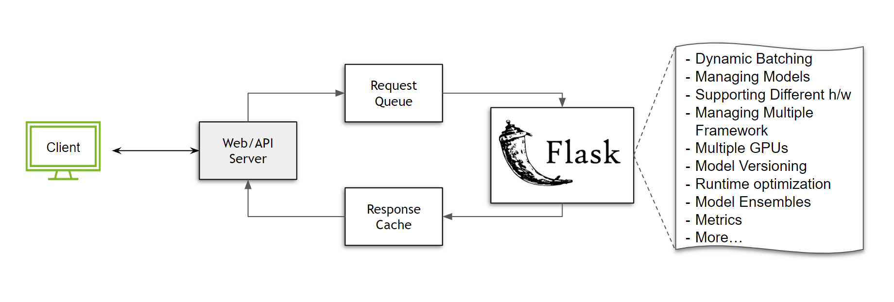

# 迁移到 Triton 推理服务器

迁移到新的推理堆栈可能看起来具有挑战性，但通过分解挑战和理解最佳实践，可以理解这项任务。在本指南中，我们展示了使用专用推理服务解决方案（如Triton推理服务器）的一些好处，并介绍了最适合您采用Triton的路径。

## 我们为什么需要专用的推理解决方案？

构建提供推理所需的基础设施可能非常复杂。让我们考虑一个简单的情况，即我们没有任何扩展，并且在不需要负载均衡器的单个节点上运行。我们需要什么来为模型服务？

如果你使用的是Python，并且是模型推理领域的新手，或者只是想快速构建一些东西，你可能会求助于像[Flask](https://flask.palletsprojects.com/en/2.2.x/)这样的工具：一个通用的微框架，可以让你自由地根据需要构建生态系统。要在flask中提供任何服务，您只需要一个可以处理传入的 POST 请求的函数。

```python
@app.route('/run_my_model',methods=['POST'])
def predict():
    data = request.get_json(force=True)

    # Pre-processing
    ...

    prediction = model(<data>)

    # Post-processing
    ...

    return output
```
只需几行代码，我们就可以启动并运行我们的模型。任何人都可以发送请求并使用该模型！但是等等，当我们开始接收多个请求时会发生什么？我们需要一种方法来对这些任务/请求进行排队。假设我们使用[Celery](https://docs.celeryq.dev/en/stable/getting-started/introduction.html)来解决这个排队挑战。在我们使用它时，我们还可以构建一个响应缓存来解决重复查询问题。



虽然上述设置确实有效，但它非常受限制且资源效率低下。为什么？假设我们正在使用一个最大批处理大小为`64`的图像分类模型，并且我们的服务器每`100 ms`收到`50`个请求。如果不实施任何形式的批处理策略，所有这些请求将必须按顺序处理，从而浪费GPU资源。这只是冰山一角。考虑以下情况：
* 如果我们想支持多个模型怎么办？我们是否需要在每次必须更新模型时重新启动服务器？
* 我们如何对模型进行版本控制？
* 我们可以在同一台服务器上提供 PyTorch 和 TensorFlow 模型吗？
* 如果一个模型需要在 CPU 上运行，而另一个模型需要 GPU，该怎么办？我们如何优化执行？
* 我们如何管理同一节点上的多个 GPU？
* 我们的执行运行时间是否优化？我们是否有效地处理了 I/O？
* 我们如何使用模型集成？
* 监控服务器指标的最佳方法是什么？

这些只是我们必须考虑的一些因素，并投入工程时间进行构建。此外，这些功能必须针对软件和硬件加速器或执行环境的每个主要版本进行定期维护和优化。随着部署规模的扩大，这些挑战只会变得更加严重。显然，解决方案不能是每个开发人员都从多用途框架开始，并花费资源构建和维护基础设施。这就是为什么拥有一个专门构建的推理服务器（如Triton推理服务器）可以解决许多问题。

## 如何将我的工作流程迁移到 Triton？

本指南假设您在概念层面上了解 Triton Inference Server 的基础知识。如果您是 Triton Inference Server 的新手，您可能需要先查看此[入门视频](https://www.youtube.com/watch?v=NQDtfSi5QF4)和此[指南](../Conceptual_Guide/Part_1-model_deployment/README.md)。

每个现有的推理流水线都是独一无二的，因此没有“一刀切”的解决方案可以将当前堆栈迁移到 Triton 推理服务器。也就是说，本指南将尝试建立直观的迁移过程。一般来说，大多数推理堆栈分为四大类。

* **与更大的模块紧密耦合**: 也许你正在迭代或微调一个模型，将模型与现有堆栈解耦需要付出相当大的努力。你仍然需要更好的性能来尽可能少地使用硬件资源，并与内部团队共享你的开发分支。隔离依赖关系、导出模型、设置某种形式的存储等所需的工作是不可行的。你需要的是一个解决方案，可以注入到现有的代码库中，不会侵入或耗时。

    在这种情况下，我们建议使用[PyTriton](https://github.com/triton-inference-server/pytriton)，它是一个类似于Flask/FastAPI的接口，用户可以通过它利用 Triton 推理服务器来实现他们的用例。

    ```python
    from pytriton.decorators import sample
    from pytriton.model_config import ModelConfig, Tensor
    from pytriton.triton import Triton

    MODEL = ...

    @sample
    def <your_function_name>(sequence: np.ndarray, labels: np.ndarray):
        # Decode input
        sequence = np.char.decode(sequence.astype("bytes"), "utf-8")
        labels = np.char.decode(labels.astype("bytes"), "utf-8")

        result = MODEL(...)

        return {"scores": results}

    # PyTriton code
    with Triton() as triton:
        triton.bind(
            model_name="<model name>",
            infer_func=<your_function_name>,      # function you want to serve
            inputs=[
                Tensor(name="sequence", dtype=bytes, shape=(1,)),
                Tensor(name="labels", dtype=bytes, shape=(-1,)),
            ],
            outputs=[
                Tensor(name="scores", dtype=np.float32, shape=(-1,)),
            ],
            # add the features you want to enable here
            config=ModelConfig(batching=False),
        )
        triton.serve()
    ```

    上面的例子是[此示例](https://github.com/triton-inference-server/pytriton/tree/main/examples/huggingface_bart_nn)的框架版本。要注意的关键点是，您希望提供的任何函数，无论它是否具有模型推理组件或只是一些python代码，都可以绑定到Triton。作为用户，您不必担心启动Triton Inference Server或构建模型存储库，所需的所有步骤都由 PyTriton 库处理。有关架构的更多信息可以在[此处找到](https://github.com/triton-inference-server/pytriton#architecture)。

* **松散耦合，但流水线错综复杂**: 假设你正在服务的流水线可以隔离到一个不同的环境中。用户通常处于模型和流水线进行内部测试并产生令人满意的结果的这个阶段。他们可能仍然在使用错综复杂的流水线，其中一些模型无法导出，并且预/后处理步骤仍然与流水线逻辑紧密耦合。

    在这种情况下，用户仍然可以使用 pytriton，但如果某些模型是可导出的，用户可以通过使用 Triton 的 Python 后端和其他框架后端来获得更高的性能。概念指南的[第 6 部分](../Conceptual_Guide/Part_6-building_complex_pipelines/README.md)是这种情况的一个很好的例子。

    目前，并非所有Triton Inference Server的功能都可以通过PyTriton来使用。用户还可以选择使用Python后端来使用Triton Inference Server提供的完整功能集。此[HuggingFace示例](../HuggingFace/README.md#deploying-on-the-python-backend)可以指导您完成具体操作。

* **松散耦合， 模块化的流水线**: 随着流水线复杂性的增加，深度学习流水线中经常会出现大量重叠的情况，即多个流水线使用一组共同的模型或预处理/后处理步骤。在这些情况下，将流水线的所有组件部署在 Triton Inference Server 上，然后[构建模型集成](https://github.com/triton-inference-server/server/blob/main/docs/user_guide/architecture.md#ensemble-models)是非常有益的。即使在没有重叠的情况下，使用 Triton 的模型集成来管理流水线也可以提供扩展能力和性能优势。有关深入解释，请参阅[本指南](../Conceptual_Guide/Part_5-Model_Ensembles/README.md)。

* **在没有预/后处理的情况下部署单个模型***: 在许多情况下，流水线逻辑以经过多年开发构建的极为优化的低级别脚本的形式存在。在这种情况下，用户可能更喜欢只部署模型，并避免HTTP/gRPC网络调用，因为模型正被更大的应用程序使用。在这种情况下，可以使用Triton的[共享内存扩展](https://github.com/triton-inference-server/server/blob/main/docs/protocol/extension_shared_memory.md#shared-memory-extension)和[C API](https://github.com/triton-inference-server/server/blob/main/docs/customization_guide/inference_protocols.md#in-process-triton-server-api)访问模型，消除了对网络接口的需要。

## 结论

虽然可以通过多种方式部署模型，但每种情况都有其自身的挑战和要求。这些要求可以通过使用各种 Triton Inference Server 功能来满足。我们鼓励您探索 Triton Inference Server [文档](https://docs.nvidia.com/deeplearning/triton-inference-server/user-guide/docs/index.html)，以了解有关这些功能的更多详细信息！